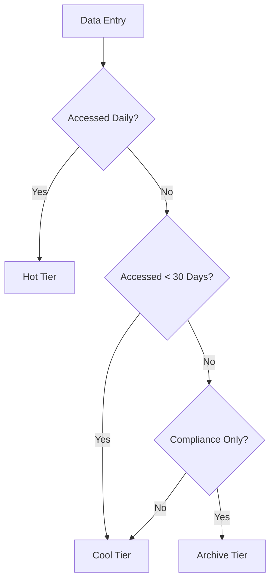

# Blob Best Practices

Efficiently manage object storage by selecting correct tiers, naming patterns, and upload strategies.

## Blob Design Decisions

| Consideration | Recommendation |
|---------------|----------------|
| Tier Selection | Match blob tier (Hot, Cool, Archive) to access frequency. |
| Object Size | Use block blobs for streaming; page blobs for VHDs. |
| Uploading | Use `Put Block` and parallel uploads for large files (>64MB). |
| Immutability | Apply WORM policies for compliance-heavy data. |
| SAS Discipline | Use User Delegation SAS over Service SAS where possible. |
| Naming | Use prefixes for virtual folders (e.g., `logs/2024/04/`). |

## Blob Tier Selection Flow

!!! tip
    Use the "Cold" tier for data that is accessed infrequently but requires immediate availability, bridging the gap between Cool and Archive.

## See Also

- [Blob Storage Basics](../platform/blob-storage-basics.md)
- [Manage Containers and Shares](../operations/manage-containers-and-shares.md)
- [Lifecycle Management Best Practices](lifecycle-management-best-practices.md)

## Sources

- [Blob Storage best practices](https://learn.microsoft.com/en-us/azure/storage/blobs/storage-blobs-introduction)
- [Access tiers overview](https://learn.microsoft.com/en-us/azure/storage/blobs/access-tiers-overview)
- [SAS best practices](https://learn.microsoft.com/en-us/azure/storage/common/storage-sas-overview#best-practices)
