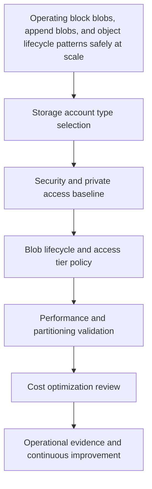
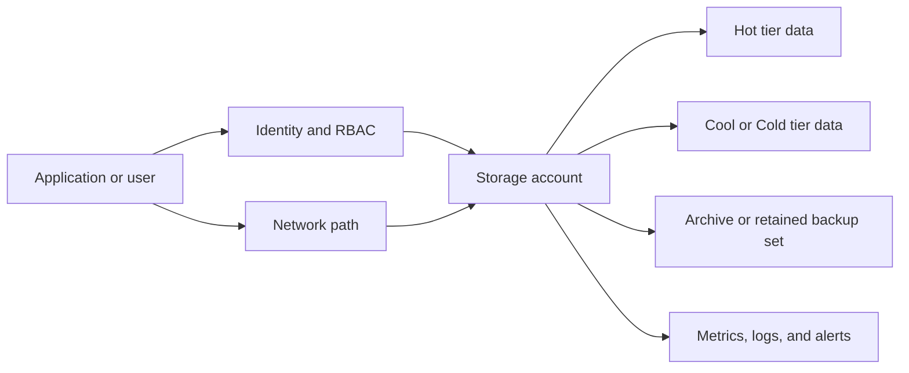

# Blob Best Practices

Blob storage works best when teams design for access patterns, object lifecycle, and security boundaries up front rather than after growth exposes hot partitions and cost surprises.

## Why This Matters

The primary goal of **Blob Best Practices** is operating block blobs, append blobs, and object lifecycle patterns safely at scale. Azure Storage is deceptively easy to start with, but production incidents usually come from design drift rather than service unavailability. Teams need a repeatable model that covers:

- Storage account type selection and when **General-purpose v2**, **Premium BlockBlobStorage**, **Premium FileStorage**, or **PageBlobStorage** are justified.
- Blob lifecycle management so data does not remain forever in the most expensive tier.
- Access tier optimization across **Hot**, **Cool**, **Cold**, and **Archive** with clear restore expectations.
- Security controls such as **Private Endpoints**, **SAS discipline**, and **RBAC-first** access patterns.
- Performance controls such as premium SKUs, partition-aware naming, concurrency tuning, and regional placement.
- Cost controls that balance capacity, transactions, retrieval, and network egress.

**Reference scenario**: A document platform stored everything in the Hot tier with sequential names such as `invoice000001.pdf`. Costs climbed, parallel upload performance flattened, and archive retrieval became a manual fire drill. Blob-specific design fixes all three problems.



## Prerequisites

- Azure subscription with rights to create and update storage resources.
- A resource group referenced as `$RG`.
- A storage account name referenced as `$STORAGE_NAME`.
- A location referenced as `$LOCATION`.
- A Log Analytics workspace resource ID referenced as `$WORKSPACE_ID` when diagnostics are enabled.
- A principal object ID referenced as `$PRINCIPAL_ID` when RBAC examples are applied.
- A subnet resource ID referenced as `$SUBNET_ID` when network rules or Private Endpoints are configured.

## Recommended Practices

### Practice 1: Match blob type to workload

**Why**: Block blobs, append blobs, and page blobs exist for different I/O behaviors.

**Real-world scenario**: A document platform stored everything in the Hot tier with sequential names such as `invoice000001.pdf`. Costs climbed, parallel upload performance flattened, and archive retrieval became a manual fire drill. Blob-specific design fixes all three problems.

**How**:

- Use block blobs for documents and media, append blobs for ordered logs, and page blobs for VHD-style random write workloads.
- Review which storage account type supports the workload most directly instead of defaulting blindly.
- Confirm whether Blob lifecycle management is needed immediately or should be staged with a short validation period first.
- Document how Hot, Cool, Cold, and Archive tiers affect user expectations, restore time, and downstream analytics.
- Make Private Endpoints, SAS scope, and RBAC part of the same design conversation rather than separate afterthoughts.
- Measure performance using representative concurrency, partition distribution, and object size before declaring the design complete.
- Capture cost impact by tracking capacity, transactions, retrieval, and egress together.

```bash
az storage account create \
    --resource-group $RG \
    --name $STORAGE_NAME \
    --location $LOCATION \
    --sku Standard_ZRS \
    --kind StorageV2 \
    --access-tier Hot \
    --allow-blob-public-access false \
    --min-tls-version TLS1_2 \
    --https-only true \
    --output json

az storage account show \
    --resource-group $RG \
    --name $STORAGE_NAME \
    --query "{name:name,kind:kind,sku:sku.name,publicAccess:allowBlobPublicAccess,httpsOnly:enableHttpsTrafficOnly}" \
    --output json
```

**Validation**:

- Confirm the command output matches the intended SKU, networking posture, and access model.
- Verify Microsoft Entra ID and RBAC are preferred over account keys for ongoing automation.
- Verify metrics and diagnostic settings are reaching the Log Analytics workspace.
- Verify the selected tier and lifecycle actions match the real access pattern rather than assumption.
### Practice 2: Design prefixes to avoid partition hotspots

**Why**: Sequential names can concentrate traffic into a narrow partition range.

**Real-world scenario**: A document platform stored everything in the Hot tier with sequential names such as `invoice000001.pdf`. Costs climbed, parallel upload performance flattened, and archive retrieval became a manual fire drill. Blob-specific design fixes all three problems.

**How**:

- Use date bucketing, customer prefixes, or hash sharding so high-volume writes distribute naturally.
- Review which storage account type supports the workload most directly instead of defaulting blindly.
- Confirm whether Blob lifecycle management is needed immediately or should be staged with a short validation period first.
- Document how Hot, Cool, Cold, and Archive tiers affect user expectations, restore time, and downstream analytics.
- Make Private Endpoints, SAS scope, and RBAC part of the same design conversation rather than separate afterthoughts.
- Measure performance using representative concurrency, partition distribution, and object size before declaring the design complete.
- Capture cost impact by tracking capacity, transactions, retrieval, and egress together.

```bash
az storage account network-rule add \
    --resource-group $RG \
    --account-name $STORAGE_NAME \
    --subnet $SUBNET_ID \
    --output json

az storage account update \
    --resource-group $RG \
    --name $STORAGE_NAME \
    --default-action Deny \
    --public-network-access Disabled \
    --output json
```

**Validation**:

- Confirm the command output matches the intended SKU, networking posture, and access model.
- Verify Microsoft Entra ID and RBAC are preferred over account keys for ongoing automation.
- Verify metrics and diagnostic settings are reaching the Log Analytics workspace.
- Verify the selected tier and lifecycle actions match the real access pattern rather than assumption.
### Practice 3: Use lifecycle rules instead of human cleanup

**Why**: Manual cleanup of temp exports, logs, and intermediate files always drifts.

**Real-world scenario**: A document platform stored everything in the Hot tier with sequential names such as `invoice000001.pdf`. Costs climbed, parallel upload performance flattened, and archive retrieval became a manual fire drill. Blob-specific design fixes all three problems.

**How**:

- Move low-touch data to Cool or Archive automatically and delete true ephemeral content after business-approved retention.
- Review which storage account type supports the workload most directly instead of defaulting blindly.
- Confirm whether Blob lifecycle management is needed immediately or should be staged with a short validation period first.
- Document how Hot, Cool, Cold, and Archive tiers affect user expectations, restore time, and downstream analytics.
- Make Private Endpoints, SAS scope, and RBAC part of the same design conversation rather than separate afterthoughts.
- Measure performance using representative concurrency, partition distribution, and object size before declaring the design complete.
- Capture cost impact by tracking capacity, transactions, retrieval, and egress together.

```bash
az role assignment create \
    --assignee-object-id $PRINCIPAL_ID \
    --assignee-principal-type ServicePrincipal \
    --role "Storage Blob Data Contributor" \
    --scope $(az storage account show --resource-group $RG --name $STORAGE_NAME --query id --output tsv) \
    --output json

az storage container generate-sas \
    --as-user \
    --auth-mode login \
    --account-name $STORAGE_NAME \
    --name $CONTAINER_NAME \
    --permissions rl \
    --expiry 2026-12-31T23:00Z \
    --https-only \
    --output tsv
```

**Validation**:

- Confirm the command output matches the intended SKU, networking posture, and access model.
- Verify Microsoft Entra ID and RBAC are preferred over account keys for ongoing automation.
- Verify metrics and diagnostic settings are reaching the Log Analytics workspace.
- Verify the selected tier and lifecycle actions match the real access pattern rather than assumption.
### Practice 4: Prefer identity-based access over account keys

**Why**: Blob containers are often the first place where uncontrolled SAS sprawl appears.

**Real-world scenario**: A document platform stored everything in the Hot tier with sequential names such as `invoice000001.pdf`. Costs climbed, parallel upload performance flattened, and archive retrieval became a manual fire drill. Blob-specific design fixes all three problems.

**How**:

- Use Microsoft Entra ID, managed identities, and user delegation SAS with short expiry and narrow permissions.
- Review which storage account type supports the workload most directly instead of defaulting blindly.
- Confirm whether Blob lifecycle management is needed immediately or should be staged with a short validation period first.
- Document how Hot, Cool, Cold, and Archive tiers affect user expectations, restore time, and downstream analytics.
- Make Private Endpoints, SAS scope, and RBAC part of the same design conversation rather than separate afterthoughts.
- Measure performance using representative concurrency, partition distribution, and object size before declaring the design complete.
- Capture cost impact by tracking capacity, transactions, retrieval, and egress together.

```bash
az storage account management-policy create \
    --resource-group $RG \
    --account-name $STORAGE_NAME \
    --policy @lifecycle-policy.json \
    --output json

az storage account management-policy show \
    --resource-group $RG \
    --account-name $STORAGE_NAME \
    --output json
```

**Validation**:

- Confirm the command output matches the intended SKU, networking posture, and access model.
- Verify Microsoft Entra ID and RBAC are preferred over account keys for ongoing automation.
- Verify metrics and diagnostic settings are reaching the Log Analytics workspace.
- Verify the selected tier and lifecycle actions match the real access pattern rather than assumption.
### Practice 5: Optimize transfer settings for large objects

**Why**: Large uploads fail or slow down when chunk sizes and concurrency are left to weak defaults.

**Real-world scenario**: A document platform stored everything in the Hot tier with sequential names such as `invoice000001.pdf`. Costs climbed, parallel upload performance flattened, and archive retrieval became a manual fire drill. Blob-specific design fixes all three problems.

**How**:

- Use AzCopy or SDK settings that align block size, concurrency, and network proximity to the compute layer.
- Review which storage account type supports the workload most directly instead of defaulting blindly.
- Confirm whether Blob lifecycle management is needed immediately or should be staged with a short validation period first.
- Document how Hot, Cool, Cold, and Archive tiers affect user expectations, restore time, and downstream analytics.
- Make Private Endpoints, SAS scope, and RBAC part of the same design conversation rather than separate afterthoughts.
- Measure performance using representative concurrency, partition distribution, and object size before declaring the design complete.
- Capture cost impact by tracking capacity, transactions, retrieval, and egress together.

```bash
az storage blob upload-batch \
    --account-name $STORAGE_NAME \
    --destination $CONTAINER_NAME \
    --source ./dataset \
    --max-connections 32 \
    --pattern "*.parquet" \
    --output table
```

**Validation**:

- Confirm the command output matches the intended SKU, networking posture, and access model.
- Verify Microsoft Entra ID and RBAC are preferred over account keys for ongoing automation.
- Verify metrics and diagnostic settings are reaching the Log Analytics workspace.
- Verify the selected tier and lifecycle actions match the real access pattern rather than assumption.
### Practice 6: Measure tiering trade-offs before mass archive moves

**Why**: Archive saves capacity cost but increases retrieval latency and rehydration planning complexity.

**Real-world scenario**: A document platform stored everything in the Hot tier with sequential names such as `invoice000001.pdf`. Costs climbed, parallel upload performance flattened, and archive retrieval became a manual fire drill. Blob-specific design fixes all three problems.

**How**:

- Set expectations with application owners before placing user-facing content in lower tiers.
- Review which storage account type supports the workload most directly instead of defaulting blindly.
- Confirm whether Blob lifecycle management is needed immediately or should be staged with a short validation period first.
- Document how Hot, Cool, Cold, and Archive tiers affect user expectations, restore time, and downstream analytics.
- Make Private Endpoints, SAS scope, and RBAC part of the same design conversation rather than separate afterthoughts.
- Measure performance using representative concurrency, partition distribution, and object size before declaring the design complete.
- Capture cost impact by tracking capacity, transactions, retrieval, and egress together.

```bash
az monitor diagnostic-settings create \
    --name "diag-$STORAGE_NAME" \
    --resource $(az storage account show --resource-group $RG --name $STORAGE_NAME --query id --output tsv) \
    --workspace $WORKSPACE_ID \
    --logs '[{"category":"StorageRead","enabled":true},{"category":"StorageWrite","enabled":true},{"category":"StorageDelete","enabled":true}]' \
    --metrics '[{"category":"Transaction","enabled":true}]' \
    --output json
```

**Validation**:

- Confirm the command output matches the intended SKU, networking posture, and access model.
- Verify Microsoft Entra ID and RBAC are preferred over account keys for ongoing automation.
- Verify metrics and diagnostic settings are reaching the Log Analytics workspace.
- Verify the selected tier and lifecycle actions match the real access pattern rather than assumption.

## Storage Account Types and When to Use Each

| Storage account type | Best fit | Why it fits | Watch-outs |
|---|---|---|---|
| General-purpose v2 (Standard) | Most production Blob, Files, Queue, and Table workloads | Broadest feature set, lifecycle management, RBAC, private networking, access tiers, and cost controls | Validate transaction costs and latency before large-scale small-object workloads |
| Premium BlockBlobStorage | Low-latency blob workloads, image processing pipelines, analytics staging, and heavy ingestion APIs | Predictable latency and higher throughput for block blobs | Higher cost and narrower service coverage than GPv2 |
| Premium FileStorage | SMB/NFS file shares with high IOPS or strict latency goals | SSD-backed performance and deterministic share behavior | Capacity planning matters because cost is premium regardless of use |
| Premium PageBlobStorage | Virtual hard disks and page-blob-specific patterns | Optimized for random read/write patterns | Rarely the right choice for modern general object storage scenarios |
| Legacy GPv1 or classic patterns | Migration-only transition scenarios | Sometimes exists in inherited estates | Treat as technical debt and move to GPv2 when feasible |

**Decision rule**:

- Start with **GPv2** unless a measured performance target justifies Premium.
- Use **Premium BlockBlobStorage** when latency and high request rates matter more than absolute capacity efficiency.
- Use **Premium FileStorage** for Azure Files workloads that cannot tolerate Standard share latency variance.
- Avoid creating new legacy account types except to support controlled migration programs.

## Blob Lifecycle Management and Access Tier Optimization

Blob lifecycle management is not only a cost tool. It is also an operating model for deciding what data should stay immediately accessible, what data can tolerate lower availability characteristics, and what data should be deleted.

### Tier guidance by access pattern

| Tier | Use when | Operational notes | Cost note |
|---|---|---|---|
| Hot | Data is read or overwritten frequently | Best for active application content, current exports, and online processing | Highest capacity cost, lowest access cost |
| Cool | Data is read infrequently but still needs fast access | Good for monthly reports, low-touch backups, and older media | Lower capacity cost, higher access cost |
| Cold | Data is accessed less often and 90-day retention is acceptable | Useful for quarterly access patterns with immediate online availability | Lower storage cost than Cool with higher access and minimum retention considerations |
| Archive | Data is retained for compliance or rare recovery only | Requires rehydration planning and cannot serve low-latency user paths | Lowest capacity cost, highest restore friction |

### Lifecycle policy example

Create a policy file such as `lifecycle-policy.json`:

```json
{
  "rules": [
    {
      "enabled": true,
      "name": "move-older-logs",
      "type": "Lifecycle",
      "definition": {
        "filters": {
          "blobTypes": ["blockBlob"],
          "prefixMatch": ["logs/"]
        },
        "actions": {
          "baseBlob": {
            "tierToCool": { "daysAfterModificationGreaterThan": 30 },
            "tierToArchive": { "daysAfterModificationGreaterThan": 180 },
            "delete": { "daysAfterModificationGreaterThan": 365 }
          }
        }
      }
    }
  ]
}
```

```bash
az storage account management-policy create \
    --resource-group $RG \
    --account-name $STORAGE_NAME \
    --policy @lifecycle-policy.json \
    --output json

az storage account management-policy show \
    --resource-group $RG \
    --account-name $STORAGE_NAME \
    --output json
```

### Lifecycle design notes

- Use prefixes and blob index tags so policy targets are explainable to operators and auditors.
- Validate archive timing with application owners because rehydration changes recovery expectations.
- Pair destructive policies with soft delete, versioning, or backup when human error is a realistic risk.
- Review policy exceptions explicitly instead of creating ad hoc containers that bypass governance.

## Security, Performance, and Cost Design Anchors

### Security baseline

- Make **RBAC** the normal data access path for users, automation, and platform tooling.
- Use **user delegation SAS** when a temporary delegated path is needed; avoid long-lived account SAS unless there is a documented exception.
- Prefer **Private Endpoints** for production data paths and keep public network access disabled when business requirements allow.
- Enable diagnostic settings and review authorization failures, network denials, and suspicious access patterns.

```bash
az role assignment create \
    --assignee-object-id $PRINCIPAL_ID \
    --assignee-principal-type ServicePrincipal \
    --role "Storage Blob Data Contributor" \
    --scope $(az storage account show --resource-group $RG --name $STORAGE_NAME --query id --output tsv) \
    --output json

az storage container generate-sas \
    --as-user \
    --auth-mode login \
    --account-name $STORAGE_NAME \
    --name $CONTAINER_NAME \
    --permissions rl \
    --expiry 2026-12-31T23:00Z \
    --https-only \
    --output tsv
```

### Performance baseline

- Choose **Premium storage** only after latency, IOPS, or throughput requirements are measured.
- Spread hot request paths across partitions using naming that avoids narrow sequential hotspots.
- Keep compute in the same region as storage for latency-sensitive operations.
- Test with real object sizes, concurrency, and retry behavior before finalizing settings.

```bash
az storage blob upload-batch \
    --account-name $STORAGE_NAME \
    --destination $CONTAINER_NAME \
    --source ./dataset \
    --max-connections 32 \
    --pattern "*.parquet" \
    --output table
```

### Cost baseline

- Separate high-transaction active data from low-touch retention datasets when that improves tiering clarity.
- Review transaction cost along with capacity cost for small-object or metadata-heavy workloads.
- Monitor egress, retrieval, and archive rehydration events so lifecycle savings are not erased elsewhere.
- Consider reserved capacity only after confirming stable long-term growth.

```bash
az monitor diagnostic-settings create \
    --name "diag-$STORAGE_NAME" \
    --resource $(az storage account show --resource-group $RG --name $STORAGE_NAME --query id --output tsv) \
    --workspace $WORKSPACE_ID \
    --logs '[{"category":"StorageRead","enabled":true},{"category":"StorageWrite","enabled":true},{"category":"StorageDelete","enabled":true}]' \
    --metrics '[{"category":"Transaction","enabled":true}]' \
    --output json
```



## Common Mistakes / Anti-Patterns

### Anti-pattern 1: Treating the storage account as a generic bucket for every use case

**What happens**: Logging, customer files, analytics staging, and backup artifacts all land in one account.

**Why it is wrong**:

- Blast radius grows.
- Cost signals blur.
- RBAC and firewall exceptions multiply.
- Lifecycle rules become overly broad or dangerously complex.

**Correct approach**: Split accounts or containers by security boundary, access pattern, and lifecycle ownership.

### Anti-pattern 2: Leaving everything in the Hot tier forever

**What happens**: Old data continues consuming premium-priced capacity without delivering business value.

**Why it is wrong**:

- Storage cost rises silently over time.
- Retrieval expectations stay undefined.
- Teams cannot distinguish active data from retained data.

**Correct approach**: Implement lifecycle movement to Cool, Cold, or Archive and delete truly expired data.

### Anti-pattern 3: Using Shared Key or broad SAS for convenience

**What happens**: Scripts, apps, and partners all receive wide permissions that are difficult to audit.

**Why it is wrong**:

- Rotation becomes risky.
- Least privilege is lost.
- Incident investigation becomes slower.

**Correct approach**: Use Microsoft Entra ID, RBAC, and short-lived user delegation SAS.

### Anti-pattern 4: Turning on Private Endpoints without validating DNS and route ownership

**What happens**: Some clients succeed while others fail or unexpectedly use public endpoints.

**Why it is wrong**:

- Troubleshooting becomes inconsistent and time-consuming.
- Security intent is not enforced uniformly.
- Failures appear random across environments.

**Correct approach**: Validate private DNS links, VNet reachability, and firewall posture from every client network.

### Anti-pattern 5: Assuming capacity cost tells the whole story

**What happens**: A “cheaper” tier is chosen that later produces retrieval bills, slower restores, or user-facing delays.

**Why it is wrong**:

- Optimization shifts cost into other services or operations.
- Teams lose trust in storage governance.
- Recovery steps become slower and more expensive.

**Correct approach**: Evaluate total cost of ownership across storage, transactions, retrieval, egress, and operational effort.

## Validation Checklist

- [ ] The storage account type is explicitly justified and documented.
- [ ] Replication choice maps to business continuity needs.
- [ ] Public access is disabled unless a documented exception exists.
- [ ] Private networking and DNS design are validated from every client segment.
- [ ] RBAC is the preferred access model for humans and applications.
- [ ] SAS usage is short-lived, least-privilege, and tracked.
- [ ] Blob lifecycle management rules exist for non-permanent data.
- [ ] Hot, Cool, Cold, and Archive tier decisions are based on real access expectations.
- [ ] Diagnostic settings are enabled for logs and metrics.
- [ ] Alerting exists for failures, latency, and suspicious access.
- [ ] Premium storage is used only where measured performance requires it.
- [ ] Naming or partition strategy was reviewed for high-traffic workloads.
- [ ] Backup, soft delete, versioning, or snapshot protections align to recovery goals.
- [ ] Capacity, transaction, retrieval, and egress costs are reviewed together.
- [ ] Ownership for lifecycle policy changes is defined.
- [ ] Documentation includes rollback and investigation steps.

## See Also

- [Blob Storage Basics](../platform/blob-storage-basics.md)
- [Manage Containers and Shares](../operations/manage-containers-and-shares.md)
- [Lifecycle Management Best Practices](lifecycle-management-best-practices.md)
- [Cost Optimization Best Practices](cost-optimization-best-practices.md)

## Sources

- [azure/storage/common/storage-account-overview](https://learn.microsoft.com/en-us/azure/storage/common/storage-account-overview)
- [azure/storage/blobs/access-tiers-overview](https://learn.microsoft.com/en-us/azure/storage/blobs/access-tiers-overview)
- [azure/storage/blobs/lifecycle-management-overview](https://learn.microsoft.com/en-us/azure/storage/blobs/lifecycle-management-overview)
- [azure/storage/common/storage-network-security](https://learn.microsoft.com/en-us/azure/storage/common/storage-network-security)
- [azure/storage/common/storage-private-endpoints](https://learn.microsoft.com/en-us/azure/storage/common/storage-private-endpoints)
- [azure/storage/common/storage-use-azcopy-v10](https://learn.microsoft.com/en-us/azure/storage/common/storage-use-azcopy-v10)
- [azure/storage/blobs/storage-performance-checklist](https://learn.microsoft.com/en-us/azure/storage/blobs/storage-performance-checklist)
- [azure/storage/blobs/security-recommendations](https://learn.microsoft.com/en-us/azure/storage/blobs/security-recommendations)
