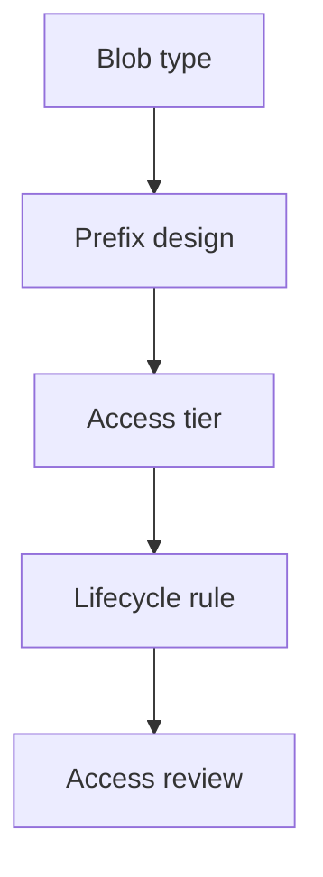

---
content_sources:
  diagrams:
    - id: best-practices-blob-best-practices
      type: flowchart
      source: mslearn-adapted
      mslearn_url: https://learn.microsoft.com/en-us/azure/storage/blobs/storage-blobs-introduction
content_validation:
  status: verified
  last_reviewed: "2026-05-21"
  reviewer: ai-agent
  core_claims:
    - claim: "Design Blob storage around access tiers, namespace shape, authorization, and lifecycle rules instead of only container creation"
      source: https://learn.microsoft.com/en-us/azure/storage/blobs/storage-blobs-introduction
      verified: true
    - claim: "A document platform stores invoices, exports, and audit evidence. Blob-specific guardrails prevent hot partitions, permanent SAS links, and uncontrolled Hot tier growth"
      source: https://learn.microsoft.com/en-us/azure/storage/blobs/storage-blobs-introduction
      verified: true
---

# Blob Best Practices

Design Blob storage around access tiers, namespace shape, authorization, and lifecycle rules instead of only container creation.

## Why This Matters

A document platform stores invoices, exports, and audit evidence. Blob-specific guardrails prevent hot partitions, permanent SAS links, and uncontrolled Hot tier growth.

<!-- diagram-id: best-practices-blob-best-practices -->

```mermaid
flowchart TD
    A[Blob type]
    B[Prefix design]
    A --> B
    C[Access tier]
    B --> C
    D[Lifecycle rule]
    C --> D
    E[Access review]
    D --> E
```

## Recommended Practices

### Practice 1: Match blob type to workload

**Why**: Use block blobs for most objects, append blobs for ordered logs, and page blobs only for page-oriented workloads.

**How**:

- Use block blobs for documents, media, backups, and most object data.
- Use append blobs only for append-style log streams that do not need arbitrary updates.
- Keep page blob usage limited to page-oriented workloads such as VHD patterns.

### Practice 2: Distribute high-volume prefixes

**Why**: Avoid one sequential naming stream when many clients upload concurrently.

**How**:

- Avoid one monotonically increasing prefix for high-concurrency uploads.
- Use date, tenant, or hash segments so hot writes spread across partitions.
- Load-test the planned object-name shape with representative client concurrency.

### Practice 3: Make tier transitions policy-driven

**Why**: Move low-touch objects to Cool, Cold, or Archive only after owners accept retrieval behavior and cost.

**How**:

- Define which prefixes can move to Cool, Cold, or Archive and who approves each transition.
- Test lifecycle rules on sample prefixes before applying broad filters.
- Document rehydration time and retrieval cost before moving operational data to Archive.

### Practice 4: Prefer Entra ID and user delegation SAS

**Why**: Reduce exposure from account keys and broad service SAS tokens.

**How**:

- Grant application identities data-plane RBAC roles at the narrowest account or container scope.
- Use user delegation SAS where SAS is required for Blob access.
- Avoid account SAS and service SAS tokens in long-lived configuration.

### CLI Validation Example

| Command | Purpose |
|---|---|
| `az storage container create` | Creates a private container with identity-based authentication. |
| `az storage blob upload-batch` | Uploads representative objects to validate names, metadata, and throughput. |

```bash
az storage container create \
    --account-name $STORAGE_NAME \
    --name $CONTAINER_NAME \
    --auth-mode login \
    --public-access off \
    --output json

az storage blob upload-batch \
    --account-name $STORAGE_NAME \
    --destination $CONTAINER_NAME \
    --source $BLOB_SAMPLE_DIR \
    --pattern "*.json" \
    --auth-mode login \
    --output table
```

## Common Mistakes / Anti-Patterns

- Using public container access for application convenience.
- Putting temporary exports and permanent evidence under the same prefix.
- Treating Archive as instant restore storage.

## Validation Checklist

- Container public access is off.
- Object names distribute hot writes.
- Lifecycle rules are tested on a non-critical prefix.
- Applications can read and write through RBAC without account keys.

## See Also

- [Blob Storage Basics](../platform/blob-storage-basics.md)
- [Lifecycle Management Best Practices](lifecycle-management-best-practices.md)
- [Manage Containers And Shares](../operations/manage-containers-and-shares.md)

## Sources

- [Microsoft Learn: Blob Best Practices](https://learn.microsoft.com/en-us/azure/storage/blobs/storage-blobs-introduction)
