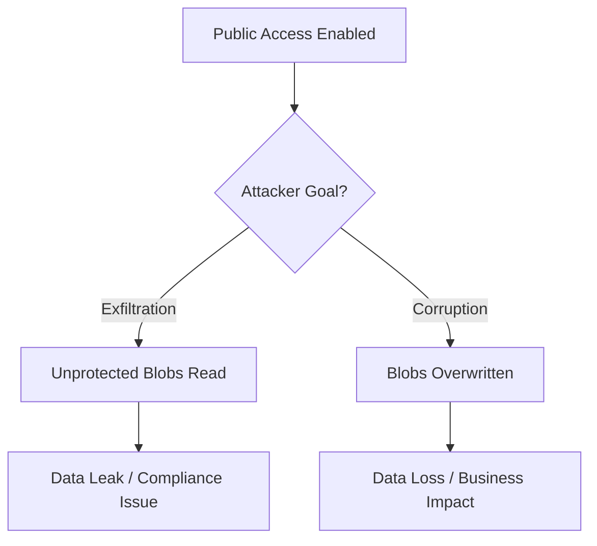

# Common Anti-Patterns

Identify and correct common mistakes when designing and managing Azure Storage solutions.

## Anti-Patterns and Corrections

| # | Anti-Pattern | Correct Approach |
|---|--------------|------------------|
| 1 | Single account for everything. | Separate by environment and workload. |
| 2 | Permanent Shared Key usage. | Use Managed Identity and RBAC. |
| 3 | Replication as backup. | Implement Soft Delete and Backup. |
| 4 | PE without DNS setup. | Use Private DNS Zones for resolution. |
| 5 | Default tier for everything. | Assess access patterns; apply tiering. |
| 6 | SAS for permanent links. | Use RBAC or short-lived User-Delegated SAS. |
| 7 | No lifecycle for logs/temp data. | Automate cleanup via Lifecycle Management. |
| 8 | Public access left enabled after PE. | Explicitly disable public access. |

## Anti-Pattern Impact Flow

!!! warning
    Disabling public access after Private Endpoint setup is critical to prevent accidental exposure of your internal storage data.

## See Also

- [Storage Account Design Baseline](storage-account-design-baseline.md)
- [Security Best Practices](security-best-practices.md)
- [Troubleshooting Index](../troubleshooting/index.md)

## Sources

- [Azure Well-Architected Storage](https://learn.microsoft.com/en-us/azure/well-architected/service-guides/azure-storage)
- [Security anti-patterns](https://learn.microsoft.com/en-us/azure/well-architected/security/anti-patterns)
- [Storage account security recommendations](https://learn.microsoft.com/en-us/azure/storage/common/security-recommendations)
