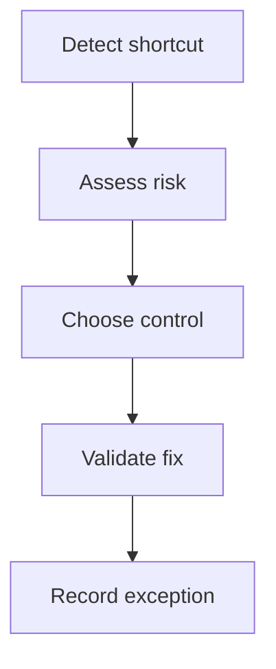

---
content_sources:
  diagrams:
    - id: best-practices-common-anti-patterns
      type: flowchart
      source: mslearn-adapted
      mslearn_url: https://learn.microsoft.com/en-us/azure/storage/common/storage-account-overview
content_validation:
  status: verified
  last_reviewed: "2026-05-21"
  reviewer: ai-agent
  core_claims:
    - claim: "Use these anti-patterns as review prompts before approving new or migrated Azure Storage workloads"
      source: https://learn.microsoft.com/en-us/azure/storage/common/storage-account-overview
      verified: true
    - claim: "Most storage incidents come from broad keys, public exposure, unclear redundancy promises, missing DNS validation, and unowned data growth"
      source: https://learn.microsoft.com/en-us/azure/storage/common/storage-account-overview
      verified: true
---

# Common Anti-Patterns

Use these anti-patterns as review prompts before approving new or migrated Azure Storage workloads.

## Why This Matters

Most storage incidents come from broad keys, public exposure, unclear redundancy promises, missing DNS validation, and unowned data growth.

<!-- diagram-id: best-practices-common-anti-patterns -->

```mermaid
flowchart TD
    A[Detect shortcut]
    B[Assess risk]
    A --> B
    C[Choose control]
    B --> C
    D[Validate fix]
    C --> D
    E[Record exception]
    D --> E
```

## Recommended Practices

### Practice 1: Replace account-key scripts

**Why**: Move recurring automation to managed identities and RBAC wherever supported.

**How**:

- Move scheduled jobs to managed identities where the Azure service supports it.
- Replace connection strings containing account keys with identity-based SDK configuration.
- Disable Shared Key after all required clients pass testing.

### Practice 2: Block public exposure by default

**Why**: Make exceptions reviewable and time-bound.

**How**:

- Set anonymous blob access off for production accounts.
- Use private endpoints or selected networks for application access.
- Review public access exceptions as security findings with expiry dates.

### Practice 3: Separate backup from redundancy

**Why**: Replication protects availability and durability, while backup protects recoverability.

**How**:

- Explain which risks replication covers and which risks backup covers.
- Enable soft delete, versioning, snapshots, or vault backup as needed.
- Run restore tests instead of treating a redundant SKU as proof of recoverability.

### Practice 4: Test private DNS before enforcement

**Why**: Private endpoints fail operationally when clients still resolve public addresses.

**How**:

- Resolve storage FQDNs from the application host, not just the operator workstation.
- Confirm blob and dfs endpoints separately for Data Lake workloads.
- Keep public access unchanged until private DNS results are correct.

### CLI Validation Example

| Command | Purpose |
|---|---|
| `az storage account show` | Surfaces public access, Shared Key, and network-rule posture. |
| `az monitor diagnostic-settings list` | Shows whether diagnostic settings exist for the account. |

```bash
az storage account show \
    --resource-group $RG \
    --name $STORAGE_NAME \
    --query "{publicBlob:allowBlobPublicAccess,sharedKey:allowSharedKeyAccess,publicNetwork:publicNetworkAccess,defaultAction:networkRuleSet.defaultAction,sku:sku.name}" \
    --output json

az monitor diagnostic-settings list \
    --resource $(az storage account show --resource-group $RG --name $STORAGE_NAME --query id --output tsv) \
    --output json
```

## Common Mistakes / Anti-Patterns

- Long-lived SAS tokens in application settings.
- RA-GRS used as the only recovery plan.
- Private endpoints created without DNS tests.
- No retention owner for old export containers.

## Validation Checklist

- No production account relies on broad Shared Key access.
- Public access exceptions are tracked.
- Diagnostics and alerts are enabled.
- DR documentation includes backup and failover evidence.

## See Also

- [Security Best Practices](security-best-practices.md)
- [Redundancy And Dr Best Practices](redundancy-and-dr-best-practices.md)
- [Monitoring And Alerting](../operations/monitoring-and-alerting.md)

## Sources

- [Microsoft Learn: Common Anti-Patterns](https://learn.microsoft.com/en-us/azure/storage/common/storage-account-overview)
