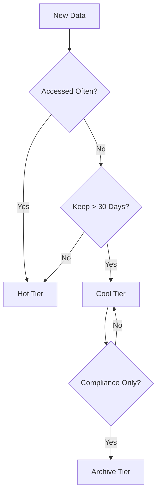

# Cost Optimization Best Practices

Maximize your Azure Storage value by leveraging tiering, lifecycle policies, and efficient access patterns.

## Cost Optimization Levers

| Lever | Saving | Tradeoff |
|-------|--------|----------|
| Tiering | High (up to 90%) | Higher latency for Archive access. |
| Lifecycle Rules | High (Automatic) | Potential deletion of needed data. |
| LRS over GRS | Medium (50%) | No regional disaster recovery. |
| Reservation | High (Up to 38%) | Upfront commitment required. |
| Egress Minimization | Medium | Restricts cross-region access. |
| Transaction Check | Low | Monitoring overhead for small objects. |

## Cost Reduction Decision Flow

!!! note
    The cost of a transaction is small, but for millions of small objects, it can exceed storage costs. Consider batching or using the Cold tier for infrequent, medium-term data.

## See Also

- [Lifecycle Management Best Practices](lifecycle-management-best-practices.md)
- [Storage Account Design Baseline](storage-account-design-baseline.md)
- [Storage Service Selection Guide](../reference/storage-service-selection-guide.md)

## Sources

- [Plan and manage costs for Azure Blob Storage](https://learn.microsoft.com/en-us/azure/storage/common/storage-plan-manage-costs)
- [Optimize costs for Blob storage with reserved capacity](https://learn.microsoft.com/en-us/azure/storage/blobs/storage-blob-reserved-capacity)
- [Billing for Blob tiers](https://learn.microsoft.com/en-us/azure/storage/blobs/access-tiers-overview#pricing-and-billing)
