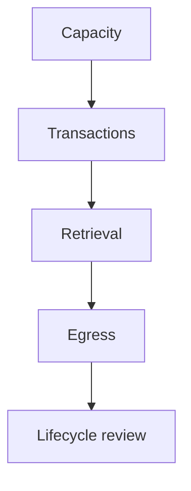

---
content_sources:
  diagrams:
    - id: best-practices-cost-optimization-best-practices
      type: flowchart
      source: mslearn-adapted
      mslearn_url: https://learn.microsoft.com/en-us/azure/storage/blobs/access-tiers-overview
content_validation:
  status: verified
  last_reviewed: "2026-05-21"
  reviewer: ai-agent
  core_claims:
    - claim: "Optimize Azure Storage cost by managing access tiers, transaction volume, retrieval, egress, redundancy, and unused data together"
      source: https://learn.microsoft.com/en-us/azure/storage/blobs/access-tiers-overview
      verified: true
    - claim: "A lake grows quickly because all data stays Hot and analytics rereads old exports daily. Cost practice separates capacity, transaction, retrieval, and network effects"
      source: https://learn.microsoft.com/en-us/azure/storage/blobs/access-tiers-overview
      verified: true
---

# Cost Optimization Best Practices

Optimize Azure Storage cost by managing access tiers, transaction volume, retrieval, egress, redundancy, and unused data together.

## Why This Matters

A lake grows quickly because all data stays Hot and analytics rereads old exports daily. Cost practice separates capacity, transaction, retrieval, and network effects.

<!-- diagram-id: best-practices-cost-optimization-best-practices -->

```mermaid
flowchart TD
    A[Capacity]
    B[Transactions]
    A --> B
    C[Retrieval]
    B --> C
    D[Egress]
    C --> D
    E[Lifecycle review]
    D --> E
```

## Recommended Practices

### Practice 1: Measure more than capacity

**Why**: Small-object transactions, read frequency, retrieval, and egress can dominate the bill.

**How**:

- Review capacity, transactions, retrieval, replication, and egress together.
- Identify small-object workloads where transaction cost dominates storage capacity.
- Separate analytics reads from application reads when assigning cost owners.

### Practice 2: Use lifecycle policies with owner approval

**Why**: Tier movement and deletion need retention owners and rollback expectations.

**How**:

- Require data-owner approval for every tiering or delete action.
- Use non-destructive tiering tests before delete rules.
- Review policy impact after the first billing cycle.

### Practice 3: Avoid overusing geo-redundancy

**Why**: GRS and GZRS should match recovery requirements, not a blanket default.

**How**:

- Select GRS or GZRS only when regional durability is part of the recovery requirement.
- Use ZRS when zone resilience is enough and regional copy is not required.
- Document cost and failover implications for every geo-redundant account.

### Practice 4: Separate cost centers with tags and accounts

**Why**: Chargeback is easier when noisy workloads are not mixed with critical data.

**How**:

- Use separate accounts when workloads have different owners, retention, or chargeback models.
- Apply tags during provisioning instead of retrofitting them later.
- Review cost by tag and account in regular governance meetings.

### CLI Validation Example

| Command | Purpose |
|---|---|
| `az storage account management-policy show` | Verifies lifecycle policy presence. |
| `az storage account blob-service-properties show` | Checks retention and versioning settings that can affect storage growth. |

```bash
az storage account management-policy show \
    --resource-group $RG \
    --account-name $STORAGE_NAME \
    --output json

az storage account blob-service-properties show \
    --resource-group $RG \
    --account-name $STORAGE_NAME \
    --query "{deleteRetention:deleteRetentionPolicy,containerDeleteRetention:containerDeleteRetentionPolicy,versioning:isVersioningEnabled}" \
    --output json
```

## Common Mistakes / Anti-Patterns

- Moving data to Archive without an agreed restore time.
- Optimizing only GB-month capacity while ignoring transactions.
- Using one account for unrelated business units with no tags.

## Validation Checklist

- Cost review includes capacity, transactions, retrieval, and egress.
- Lifecycle actions are reviewed with data owners.
- Redundancy selection has a recovery rationale.
- Tags support cost ownership reporting.

## See Also

- [Lifecycle Management Best Practices](lifecycle-management-best-practices.md)
- [Manage Lifecycle Policies](../operations/manage-lifecycle-policies.md)
- [Storage Service Selection Guide](../reference/storage-service-selection-guide.md)

## Sources

- [Microsoft Learn: Cost Optimization Best Practices](https://learn.microsoft.com/en-us/azure/storage/blobs/access-tiers-overview)
