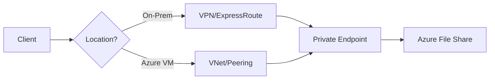

# File Share Best Practices

Optimize Azure Files for performance, accessibility, and integration with cloud-native services.

## File Share Checklist

| Category | Best Practice |
|----------|---------------|
| Networking | Verify DNS resolution for Private Endpoints before mounting. |
| Protocol | Choose SMB for Windows/Standard; NFS for Linux/Performance. |
| Scalability | Use Premium tier for IOPS-intensive workloads. |
| Identity | Use AD DS or Azure AD DS for fine-grained NTFS permissions. |
| Integration | Use Azure File Sync to cache shares on-premises. |
| Performance | Monitor `SuccessE2ELatency` to identify bottlenecks. |

## File Share Access Path

!!! note
    When using Azure App Service with Azure Files, ensure the App Service is VNet-integrated to access shares via Private Endpoints.

## See Also

- [File Storage Basics](../platform/file-storage-basics.md)
- [Manage Containers and Shares](../operations/manage-containers-and-shares.md)
- [File Share Mount Issues](../troubleshooting/file-share-mount-issues.md)

## Sources

- [Azure Files planning guide](https://learn.microsoft.com/en-us/azure/storage/files/storage-files-planning)
- [Performance targets for Azure Files](https://learn.microsoft.com/en-us/azure/storage/files/storage-files-scale-targets)
- [Azure Files networking considerations](https://learn.microsoft.com/en-us/azure/storage/files/storage-files-networking-overview)
