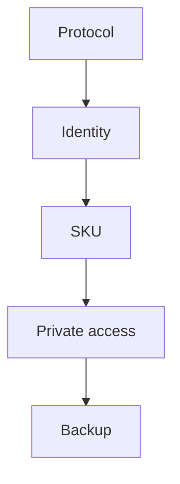

---
content_sources:
  diagrams:
    - id: best-practices-file-share-best-practices
      type: flowchart
      source: mslearn-adapted
      mslearn_url: https://learn.microsoft.com/en-us/azure/storage/files/storage-files-introduction
content_validation:
  status: verified
  last_reviewed: "2026-05-21"
  reviewer: ai-agent
  core_claims:
    - claim: "Use Azure Files for SMB or NFS workloads only after validating protocol, identity, latency, and redundancy constraints"
      source: https://learn.microsoft.com/en-us/azure/storage/files/storage-files-introduction
      verified: true
    - claim: "A migration team moves a line-of-business file share to Azure Files. The design must preserve identity behavior, predictable latency, and recovery expectations"
      source: https://learn.microsoft.com/en-us/azure/storage/files/storage-files-introduction
      verified: true
---

# File Share Best Practices

Use Azure Files for SMB or NFS workloads only after validating protocol, identity, latency, and redundancy constraints.

## Why This Matters

A migration team moves a line-of-business file share to Azure Files. The design must preserve identity behavior, predictable latency, and recovery expectations.

<!-- diagram-id: best-practices-file-share-best-practices -->

```mermaid
flowchart TD
    A[Protocol]
    B[Identity]
    A --> B
    C[SKU]
    B --> C
    D[Private access]
    C --> D
    E[Backup]
    D --> E
```

## Recommended Practices

### Practice 1: Choose SMB or NFS from client requirements

**Why**: Protocol choice affects identity integration, mount behavior, and network rules.

**How**:

- Inventory client operating systems, protocol requirements, and identity expectations before share creation.
- Select SMB when Windows identity integration and broad client support matter.
- Select NFS only where supported client and network constraints are already validated.

### Practice 2: Use Premium FileStorage for latency-sensitive shares

**Why**: Standard shares are cost-effective, but performance-sensitive workloads should be measured against Premium.

**How**:

- Benchmark latency, IOPS, and throughput with the real file mix before migration.
- Use Premium FileStorage for workloads that cannot tolerate Standard share variance.
- Keep capacity-heavy but latency-tolerant shares on Standard when tests support it.

### Practice 3: Plan identity before migration

**Why**: AD DS, Microsoft Entra Kerberos, or identityless access changes client rollout and support procedures.

**How**:

- Choose AD DS, Microsoft Entra Kerberos, or another supported identity model before copying data.
- Test share-level RBAC and NTFS ACL behavior with pilot users.
- Document the rollback path if clients cannot authenticate after cutover.

### Practice 4: Protect shares with snapshots and backup

**Why**: Replication is not enough for accidental deletion, ransomware, or operator mistakes.

**How**:

- Enable share snapshots or Azure Backup according to restore requirements.
- Test single-file and full-share recovery before migration sign-off.
- Monitor snapshot and backup retention so protection does not become unmanaged cost growth.

### CLI Validation Example

| Command | Purpose |
|---|---|
| `az storage share-rm create` | Creates an Azure Files share through the resource provider. |
| `az storage share-rm show` | Verifies quota, protocol, and provisioned settings. |

```bash
az storage share-rm create \
    --resource-group $RG \
    --storage-account $STORAGE_NAME \
    --name $SHARE_NAME \
    --quota 1024 \
    --enabled-protocols SMB \
    --output json

az storage share-rm show \
    --resource-group $RG \
    --storage-account $STORAGE_NAME \
    --name $SHARE_NAME \
    --query "{name:name,quota:shareQuota,protocol:enabledProtocols}" \
    --output json
```

## Common Mistakes / Anti-Patterns

- Migrating latency-sensitive file workloads without a Premium test.
- Using account keys for broad SMB access when share-level RBAC is required.
- Assuming RA-GRS secondary reads apply to Azure Files.

## Validation Checklist

- Protocol and identity model are documented.
- Client mount tests cover normal and failure paths.
- Backup or snapshot retention is enabled.
- Azure Files redundancy limits are reflected in DR documentation.

## See Also

- [File Storage Basics](../platform/file-storage-basics.md)
- [Backup And Data Protection](../operations/backup-and-data-protection.md)
- [Redundancy And Durability](../platform/redundancy-and-durability.md)

## Sources

- [Microsoft Learn: File Share Best Practices](https://learn.microsoft.com/en-us/azure/storage/files/storage-files-introduction)
