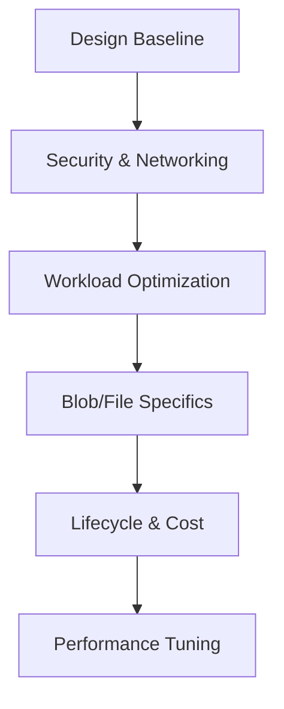

# Best Practices

Comprehensive guide for designing, securing, and optimizing Azure Storage solutions based on official Microsoft recommendations.

## Best Practices Overview

| Topic | Description |
|-------|-------------|
| [Design Baseline](storage-account-design-baseline.md) | Initial setup, naming, and redundancy strategy. |
| [Blob Storage](blob-best-practices.md) | Optimization for object storage and tiering. |
| [File Shares](file-share-best-practices.md) | Best practices for Azure Files and networking. |
| [Security](security-best-practices.md) | Identity, access control, and data protection. |
| [Networking](networking-best-practices.md) | Private Endpoints and firewall configurations. |
| [Redundancy & DR](redundancy-and-dr-best-practices.md) | High availability and disaster recovery planning. |
| [Performance](performance-best-practices.md) | Scaling and throughput optimization. |
| [Cost Optimization](cost-optimization-best-practices.md) | Reducing spend via tiering and lifecycle rules. |
| [Lifecycle Management](lifecycle-management-best-practices.md) | Automated data transition and deletion. |
| [Common Anti-Patterns](common-anti-patterns.md) | Mistakes to avoid in production environments. |

## Best Practices Flow

!!! note
    Follow the learning path first, then baseline design, then anti-pattern review before production rollout.

## See Also

- [Learning Path](../start-here/learning-path.md)
- [Storage Account Design Baseline](storage-account-design-baseline.md)
- [Common Anti-Patterns](common-anti-patterns.md)

## Sources

- [Azure Storage documentation](https://learn.microsoft.com/en-us/azure/storage/)
- [Azure Security baseline for Storage](https://learn.microsoft.com/en-us/security/benchmark/azure/baselines/azure-storage-security-baseline)
- [Microsoft Azure Well-Architected Framework - Storage](https://learn.microsoft.com/en-us/azure/well-architected/service-guides/azure-storage)
