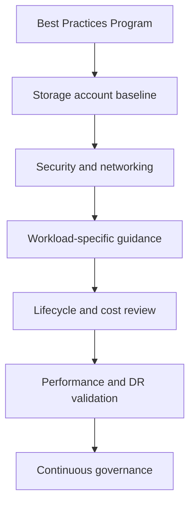
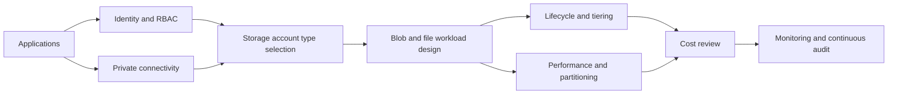

---
hide:
  - toc
---

# Best Practices

This section turns Azure Storage platform concepts into production operating guidance. Use it to move from “it works” to “it is secure, supportable, scalable, and cost-aware.”

## Why This Section Exists

Storage workloads often start simple and become complex quickly. A few containers or shares grow into business-critical systems that now require lifecycle management, private connectivity, access governance, replication planning, and cost controls. This section exists to help teams standardize:

- Storage account type selection and when to choose Standard versus Premium offerings.
- Blob lifecycle management and retention ownership.
- Access tier optimization across Hot, Cool, Cold, and Archive.
- Security defaults using Private Endpoints, SAS discipline, and RBAC.
- Performance design using regional placement, partition-aware naming, and throughput testing.
- Cost optimization that includes transactions, retrieval, and egress rather than just capacity.



## Reading Order

1. Start with the baseline so naming, replication, and security defaults are consistent.
2. Read the workload-specific pages for Blob, Files, networking, and performance.
3. Review lifecycle, cost, and redundancy before the first production launch.
4. End with anti-patterns to pressure-test whether your design still contains inherited shortcuts.

## Topic Map

| Topic | What it covers | Best first reader |
|---|---|---|
| [Storage Account Design Baseline](storage-account-design-baseline.md) | Core defaults for account creation, ownership, and replication | Platform engineers and architects |
| [Blob Best Practices](blob-best-practices.md) | Object storage patterns, tiers, and partition-aware design | Application teams using Blob storage |
| [File Share Best Practices](file-share-best-practices.md) | SMB/NFS design, identity, and private access for Azure Files | Infrastructure and migration teams |
| [Security Best Practices](security-best-practices.md) | RBAC, SAS, encryption, logging, and private access | Security and platform teams |
| [Networking Best Practices](networking-best-practices.md) | DNS, Private Endpoints, firewall rules, and routing | Network and platform engineers |
| [Redundancy and DR Best Practices](redundancy-and-dr-best-practices.md) | Replication choices, failover readiness, and recovery strategy | Architects and incident owners |
| [Performance Best Practices](performance-best-practices.md) | Throughput, latency, Premium tiers, and partitions | Performance-focused engineering teams |
| [Cost Optimization Best Practices](cost-optimization-best-practices.md) | Tiering, lifecycle, reserved capacity, and charge visibility | Platform owners and finance partners |
| [Lifecycle Management Best Practices](lifecycle-management-best-practices.md) | Automated retention, movement, and cleanup | Data owners and governance leads |
| [Common Anti-Patterns](common-anti-patterns.md) | Recurring mistakes and how to correct them | Reviewers and migration teams |

## Production Review Matrix

| Decision area | Questions to answer before go-live | Signals that the design is weak |
|---|---|---|
| Storage account type | Is GPv2 enough, or does Premium BlockBlobStorage or FileStorage solve a measured latency requirement? | Premium was chosen “just in case,” or legacy account types still exist without migration plan |
| Lifecycle | What data moves to Cool, Cold, or Archive, and who owns the policy? | No owner for retention, no sample objects used for validation |
| Security | Are Private Endpoints, RBAC, and short-lived SAS the default? | Shared Key scripts or permanent SAS links are still active |
| Performance | Have naming, partitioning, concurrency, and region placement been load-tested? | Sequential object names, cross-region data access, or unexplained retries |
| Cost | Are transactions, retrieval, and egress visible separately from capacity? | Teams optimize only the storage capacity line item |
| Recovery | Do replication and backup choices align to restore promises? | “We use GRS” is treated as the entire DR answer |

## Storage Account Type Strategy

| Type | Recommended use | Why teams pick it | When to avoid it |
|---|---|---|---|
| GPv2 Standard | Default for most workloads | Broad capability set and balanced cost | Avoid only when measured Premium requirements exist |
| Premium BlockBlobStorage | High-throughput, low-latency blob workloads | Better consistency for heavy object processing | Avoid for mixed-service estates needing Queue/Table/Files in one account |
| Premium FileStorage | High-IOPS Azure Files | Reliable file-share performance | Avoid when workload is capacity-heavy but not latency-sensitive |
| PageBlobStorage | Niche page-blob patterns | VHD/random-write optimization | Avoid for modern content or general object storage |

## Cross-Cutting Architecture View



## Topic-by-Topic Guidance

### Storage Account Design Baseline

**Intent**: Establishing production-ready defaults for new storage accounts.

**Use this page when**:

- You are planning a new storage workload and need topic-specific guardrails.
- You are reviewing an existing estate for security, lifecycle, cost, or performance debt.
- You need practical CLI-backed guidance rather than only conceptual documentation.

**Priority questions answered**:

- Which storage account type fits this workload best?
- How should Blob lifecycle and Hot/Cool/Cold/Archive tiers be applied?
- Which security controls should be mandatory?
- When does Premium storage or partition-aware design matter?
- Which costs should be measured before sign-off?

Primary document: [Storage Account Design Baseline](storage-account-design-baseline.md)
### Blob Best Practices

**Intent**: Operating block blobs, append blobs, and object lifecycle patterns safely at scale.

**Use this page when**:

- You are planning a new storage workload and need topic-specific guardrails.
- You are reviewing an existing estate for security, lifecycle, cost, or performance debt.
- You need practical CLI-backed guidance rather than only conceptual documentation.

**Priority questions answered**:

- Which storage account type fits this workload best?
- How should Blob lifecycle and Hot/Cool/Cold/Archive tiers be applied?
- Which security controls should be mandatory?
- When does Premium storage or partition-aware design matter?
- Which costs should be measured before sign-off?

Primary document: [Blob Best Practices](blob-best-practices.md)
### File Share Best Practices

**Intent**: Running smb and nfs file shares with predictable access, performance, and security.

**Use this page when**:

- You are planning a new storage workload and need topic-specific guardrails.
- You are reviewing an existing estate for security, lifecycle, cost, or performance debt.
- You need practical CLI-backed guidance rather than only conceptual documentation.

**Priority questions answered**:

- Which storage account type fits this workload best?
- How should Blob lifecycle and Hot/Cool/Cold/Archive tiers be applied?
- Which security controls should be mandatory?
- When does Premium storage or partition-aware design matter?
- Which costs should be measured before sign-off?

Primary document: [File Share Best Practices](file-share-best-practices.md)
### Security Best Practices

**Intent**: Defense-in-depth controls for azure storage data plane and management plane access.

**Use this page when**:

- You are planning a new storage workload and need topic-specific guardrails.
- You are reviewing an existing estate for security, lifecycle, cost, or performance debt.
- You need practical CLI-backed guidance rather than only conceptual documentation.

**Priority questions answered**:

- Which storage account type fits this workload best?
- How should Blob lifecycle and Hot/Cool/Cold/Archive tiers be applied?
- Which security controls should be mandatory?
- When does Premium storage or partition-aware design matter?
- Which costs should be measured before sign-off?

Primary document: [Security Best Practices](security-best-practices.md)
### Networking Best Practices

**Intent**: Private connectivity, dns design, and network-boundary control for azure storage.

**Use this page when**:

- You are planning a new storage workload and need topic-specific guardrails.
- You are reviewing an existing estate for security, lifecycle, cost, or performance debt.
- You need practical CLI-backed guidance rather than only conceptual documentation.

**Priority questions answered**:

- Which storage account type fits this workload best?
- How should Blob lifecycle and Hot/Cool/Cold/Archive tiers be applied?
- Which security controls should be mandatory?
- When does Premium storage or partition-aware design matter?
- Which costs should be measured before sign-off?

Primary document: [Networking Best Practices](networking-best-practices.md)
### Redundancy and DR Best Practices

**Intent**: Aligning storage replication choices with continuity objectives and failover readiness.

**Use this page when**:

- You are planning a new storage workload and need topic-specific guardrails.
- You are reviewing an existing estate for security, lifecycle, cost, or performance debt.
- You need practical CLI-backed guidance rather than only conceptual documentation.

**Priority questions answered**:

- Which storage account type fits this workload best?
- How should Blob lifecycle and Hot/Cool/Cold/Archive tiers be applied?
- Which security controls should be mandatory?
- When does Premium storage or partition-aware design matter?
- Which costs should be measured before sign-off?

Primary document: [Redundancy and DR Best Practices](redundancy-and-dr-best-practices.md)
### Performance Best Practices

**Intent**: Throughput, latency, and scale planning for azure storage workloads.

**Use this page when**:

- You are planning a new storage workload and need topic-specific guardrails.
- You are reviewing an existing estate for security, lifecycle, cost, or performance debt.
- You need practical CLI-backed guidance rather than only conceptual documentation.

**Priority questions answered**:

- Which storage account type fits this workload best?
- How should Blob lifecycle and Hot/Cool/Cold/Archive tiers be applied?
- Which security controls should be mandatory?
- When does Premium storage or partition-aware design matter?
- Which costs should be measured before sign-off?

Primary document: [Performance Best Practices](performance-best-practices.md)
### Cost Optimization Best Practices

**Intent**: Reducing azure storage spend without undermining reliability or security.

**Use this page when**:

- You are planning a new storage workload and need topic-specific guardrails.
- You are reviewing an existing estate for security, lifecycle, cost, or performance debt.
- You need practical CLI-backed guidance rather than only conceptual documentation.

**Priority questions answered**:

- Which storage account type fits this workload best?
- How should Blob lifecycle and Hot/Cool/Cold/Archive tiers be applied?
- Which security controls should be mandatory?
- When does Premium storage or partition-aware design matter?
- Which costs should be measured before sign-off?

Primary document: [Cost Optimization Best Practices](cost-optimization-best-practices.md)
### Lifecycle Management Best Practices

**Intent**: Automating data movement, retention, and deletion decisions for blob data.

**Use this page when**:

- You are planning a new storage workload and need topic-specific guardrails.
- You are reviewing an existing estate for security, lifecycle, cost, or performance debt.
- You need practical CLI-backed guidance rather than only conceptual documentation.

**Priority questions answered**:

- Which storage account type fits this workload best?
- How should Blob lifecycle and Hot/Cool/Cold/Archive tiers be applied?
- Which security controls should be mandatory?
- When does Premium storage or partition-aware design matter?
- Which costs should be measured before sign-off?

Primary document: [Lifecycle Management Best Practices](lifecycle-management-best-practices.md)
### Common Anti-Patterns

**Intent**: Identifying and correcting recurring azure storage design mistakes.

**Use this page when**:

- You are planning a new storage workload and need topic-specific guardrails.
- You are reviewing an existing estate for security, lifecycle, cost, or performance debt.
- You need practical CLI-backed guidance rather than only conceptual documentation.

**Priority questions answered**:

- Which storage account type fits this workload best?
- How should Blob lifecycle and Hot/Cool/Cold/Archive tiers be applied?
- Which security controls should be mandatory?
- When does Premium storage or partition-aware design matter?
- Which costs should be measured before sign-off?

Primary document: [Common Anti-Patterns](common-anti-patterns.md)

## Standard CLI Foundation

Use readable long-flag commands and consistent variables:

```bash
az storage account create \
    --resource-group $RG \
    --name $STORAGE_NAME \
    --location $LOCATION \
    --sku Standard_LRS \
    --kind StorageV2 \
    --access-tier Hot \
    --https-only true \
    --min-tls-version TLS1_2 \
    --allow-blob-public-access false \
    --output json
```

```bash
az storage account show \
    --resource-group $RG \
    --name $STORAGE_NAME \
    --query "{kind:kind,sku:sku.name,primaryLocation:primaryLocation,publicAccess:allowBlobPublicAccess}" \
    --output json
```

```bash
az storage account management-policy show \
    --resource-group $RG \
    --account-name $STORAGE_NAME \
    --output json
```

## Rollout Checklist by Phase

### Phase 1: Baseline

- Standardize naming, tagging, and ownership.
- Choose replication from business recovery needs.
- Disable unnecessary public exposure.
- Enable diagnostics before data migration.

### Phase 2: Security and Networking

- Implement Private Endpoints where production policy requires them.
- Link Private DNS Zones to every participating VNet.
- Assign RBAC roles to applications and operators.
- Remove unmanaged use of account keys.

### Phase 3: Data Lifecycle and Tiering

- Classify datasets by retention and access expectations.
- Publish Hot, Cool, Cold, and Archive policy guidance.
- Test lifecycle rules with representative prefixes and tags.
- Document archive restore expectations.

### Phase 4: Performance and Cost Validation

- Load-test partition naming and concurrency.
- Decide whether Premium storage is justified.
- Measure transaction, retrieval, and egress costs.
- Review data movement patterns with application teams.

### Phase 5: Continuous Governance

- Review settings quarterly.
- Audit lifecycle exceptions.
- Review SAS issuance and RBAC scope regularly.
- Use anti-patterns as a design-review checklist.

## See Also

- [Learning Path](../start-here/learning-path.md)
- [Storage Service Selection Guide](../reference/storage-service-selection-guide.md)
- [Storage Account Design Baseline](storage-account-design-baseline.md)
- [Common Anti-Patterns](common-anti-patterns.md)

## Sources

- [azure/storage/](https://learn.microsoft.com/en-us/azure/storage/)
- [azure/storage/common/storage-account-overview](https://learn.microsoft.com/en-us/azure/storage/common/storage-account-overview)
- [azure/storage/blobs/access-tiers-overview](https://learn.microsoft.com/en-us/azure/storage/blobs/access-tiers-overview)
- [azure/storage/blobs/lifecycle-management-overview](https://learn.microsoft.com/en-us/azure/storage/blobs/lifecycle-management-overview)
- [azure/security/benchmark/azure/baselines/storage-security-baseline](https://learn.microsoft.com/en-us/security/benchmark/azure/baselines/storage-security-baseline)
