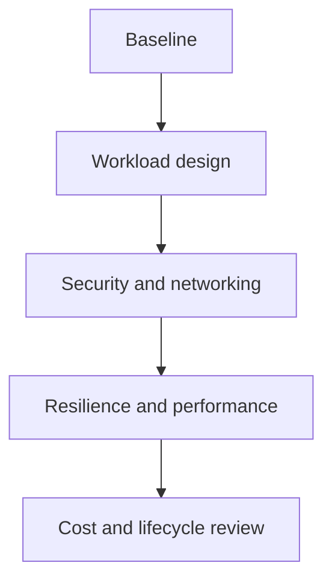

---
content_sources:
  diagrams:
    - id: best-practices-index
      type: flowchart
      source: mslearn-adapted
      mslearn_url: https://learn.microsoft.com/en-us/azure/storage/common/storage-account-overview
content_validation:
  status: verified
  last_reviewed: "2026-05-21"
  reviewer: ai-agent
  core_claims:
    - claim: "Azure Storage production guidance should cover account design, workload-specific controls, operations, resilience, and cost"
      source: https://learn.microsoft.com/en-us/azure/storage/common/storage-account-overview
      verified: true
    - claim: "Microsoft Learn is the source basis for the repository best-practices structure"
      source: https://learn.microsoft.com/en-us/azure/storage/common/storage-account-overview
      verified: true
---
# Best Practices

This section turns Azure Storage platform concepts into practical production review guidance.

<!-- diagram-id: best-practices-index -->

```mermaid
flowchart TD
    A[Baseline]
    B[Workload design]
    A --> B
    C[Security and networking]
    B --> C
    D[Resilience and performance]
    C --> D
    E[Cost and lifecycle review]
    D --> E
```

## Reading Order

1. Start with the storage account baseline.
2. Read the Blob or Files guidance for the workload type.
3. Review security, networking, and redundancy before go-live.
4. Finish with performance, cost, lifecycle, and anti-pattern checks.

## Topic Map

| Topic | Use it for |
|---|---|
| [Storage Account Design Baseline](storage-account-design-baseline.md) | Account type, ownership, security defaults, and redundancy choices. |
| [Blob Best Practices](blob-best-practices.md) | Object storage, prefix shape, access tiers, and lifecycle. |
| [File Share Best Practices](file-share-best-practices.md) | Azure Files protocol, identity, performance, and recovery. |
| [Security Best Practices](security-best-practices.md) | RBAC, Shared Key, SAS, and audit evidence. |
| [Networking Best Practices](networking-best-practices.md) | Firewall rules, Private Endpoints, DNS, and denied-path tests. |
| [Redundancy and DR Best Practices](redundancy-and-dr-best-practices.md) | RPO/RTO, failover, Azure Files exceptions, and backup. |
| [Performance Best Practices](performance-best-practices.md) | Scale targets, partitioning, concurrency, and retries. |
| [Cost Optimization Best Practices](cost-optimization-best-practices.md) | Capacity, transactions, retrieval, egress, and tiering. |
| [Lifecycle Management Best Practices](lifecycle-management-best-practices.md) | Retention, tiering, deletion, and owner review. |
| [Common Anti-Patterns](common-anti-patterns.md) | Review prompts for recurring design failures. |

## See Also

- [Platform](../platform/index.md)
- [Operations](../operations/index.md)
- [Storage Service Selection Guide](../reference/storage-service-selection-guide.md)

## Sources

- [Microsoft Learn: Storage account overview](https://learn.microsoft.com/en-us/azure/storage/common/storage-account-overview)
