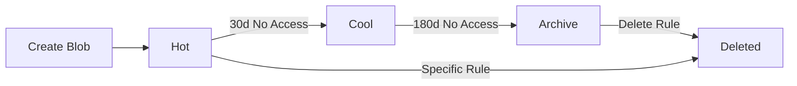

# Lifecycle Management Best Practices

Automate data transitions and deletions to maintain storage hygiene and cost efficiency.

## Lifecycle Policy Scenarios

| Scenario | Rule Configuration | Retention |
|----------|--------------------|-----------|
| Diagnostic Logs | Move to Cool (30d) → Delete (90d). | 90 days. |
| Compliance Backups | Move to Archive (14d). | Permanent or 7+ years. |
| Temporary Data | Delete if not modified (7d). | 7 days. |
| Application Data | Move to Cool after 180 days. | Ongoing. |

## Lifecycle Policy Flow

!!! tip
    Enable versioning and soft delete to protect against accidental deletions before lifecycle rules execute.

## Sources

- [Blob Lifecycle Management](https://learn.microsoft.com/en-us/azure/storage/blobs/lifecycle-management-overview)
- [Optimize costs via lifecycle](https://learn.microsoft.com/en-us/azure/storage/blobs/storage-lifecycle-management-concepts)
- [Soft delete for blobs](https://learn.microsoft.com/en-us/azure/storage/blobs/soft-delete-blob-overview)
