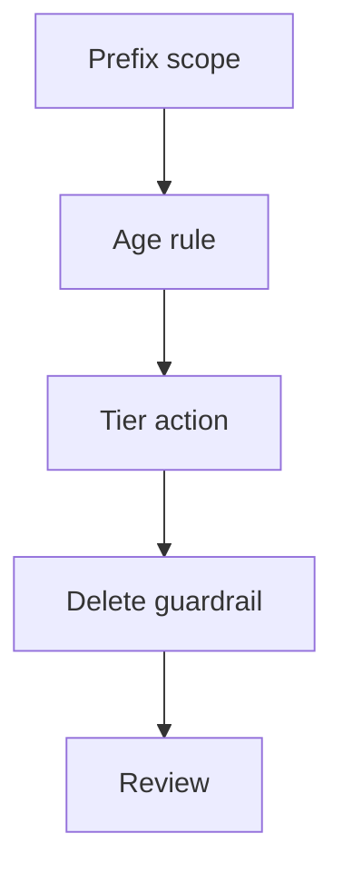

---
content_sources:
  diagrams:
    - id: best-practices-lifecycle-management-best-practices
      type: flowchart
      source: mslearn-adapted
      mslearn_url: https://learn.microsoft.com/en-us/azure/storage/blobs/lifecycle-management-overview
content_validation:
  status: verified
  last_reviewed: "2026-05-21"
  reviewer: ai-agent
  core_claims:
    - claim: "Lifecycle management should encode retention and tiering decisions that have already been approved by data owners"
      source: https://learn.microsoft.com/en-us/azure/storage/blobs/lifecycle-management-overview
      verified: true
    - claim: "Export containers accumulate years of temporary data. Lifecycle policy fixes the cost issue only when prefixes, age rules, and deletion approvals are explicit"
      source: https://learn.microsoft.com/en-us/azure/storage/blobs/lifecycle-management-overview
      verified: true
---

# Lifecycle Management Best Practices

Lifecycle management should encode retention and tiering decisions that have already been approved by data owners.

## Why This Matters

Export containers accumulate years of temporary data. Lifecycle policy fixes the cost issue only when prefixes, age rules, and deletion approvals are explicit.

<!-- diagram-id: best-practices-lifecycle-management-best-practices -->

```mermaid
flowchart TD
    A[Prefix scope]
    B[Age rule]
    A --> B
    C[Tier action]
    B --> C
    D[Delete guardrail]
    C --> D
    E[Review]
    D --> E
```

## Recommended Practices

### Practice 1: Scope rules by prefix and blob type

**Why**: Broad rules can move or delete unrelated data if account layout is not clean.

**How**:

- Use prefix filters that map to one data owner and one retention policy.
- Limit rules to block blobs unless another blob type is explicitly required.
- Review new prefixes before assuming existing lifecycle rules cover them.

### Practice 2: Stage destructive rules

**Why**: Start with tier movement and short test prefixes before delete actions affect production data.

**How**:

- Deploy tiering rules before delete rules where possible.
- Apply delete actions to a test prefix and inspect results before broad rollout.
- Keep retention approvals with the policy change record.

### Practice 3: Record restore behavior

**Why**: Cool, Cold, and Archive tiers have different retrieval cost and timing implications.

**How**:

- Document expected rehydration priority and time for Archive data.
- Test retrieval of a sample object after tier movement.
- Publish restore expectations to support and application owners.

### Practice 4: Review policy execution periodically

**Why**: Rules can become stale as applications add new prefixes.

**How**:

- Check rules after teams add new containers or prefixes.
- Compare policy intent with actual object age and tier distribution.
- Update rules when business retention changes.

### CLI Validation Example

| Command | Purpose |
|---|---|
| `az storage account management-policy create` | Applies a reviewed lifecycle policy. |
| `az storage account management-policy show` | Confirms the active rules after deployment. |

```bash
az storage account management-policy create \
    --resource-group $RG \
    --account-name $STORAGE_NAME \
    --policy '{"rules":[{"enabled":true,"name":"tier-logs","type":"Lifecycle","definition":{"actions":{"baseBlob":{"tierToCool":{"daysAfterModificationGreaterThan":30}}},"filters":{"blobTypes":["blockBlob"],"prefixMatch":["logs/"]}}}]}' \
    --output json

az storage account management-policy show \
    --resource-group $RG \
    --account-name $STORAGE_NAME \
    --output json
```

## Common Mistakes / Anti-Patterns

- Applying delete rules to broad prefixes without a restore test.
- Assuming lifecycle policy runs immediately after creation.
- Using Archive for data that must be restored during short incidents.

## Validation Checklist

- Each rule has an owner and retention rationale.
- Policy scope is limited to known prefixes.
- Archive and delete actions have approval.
- A sample object proves the rule targets the expected data.

## See Also

- [Manage Lifecycle Policies](../operations/manage-lifecycle-policies.md)
- [Cost Optimization Best Practices](cost-optimization-best-practices.md)
- [Lifecycle Policy Not Working](../troubleshooting/playbooks/lifecycle-policy-not-working.md)

## Sources

- [Microsoft Learn: Lifecycle Management Best Practices](https://learn.microsoft.com/en-us/azure/storage/blobs/lifecycle-management-overview)
