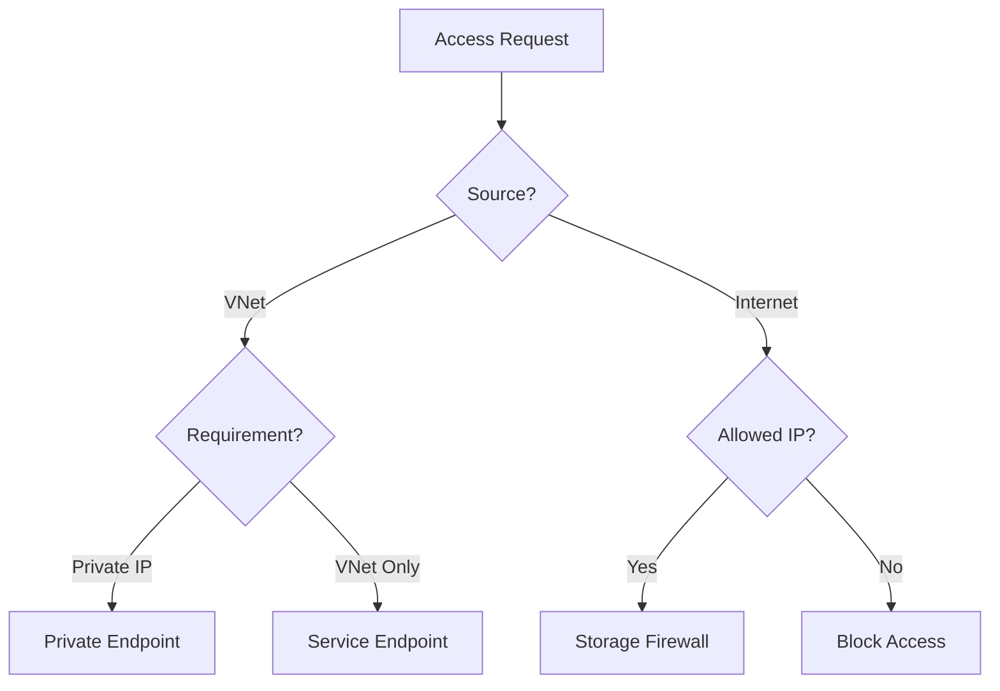

# Networking Best Practices

Secure your storage data using private networking and firewall configurations.

## Networking Design Checklist

| Component | Recommendation |
|-----------|----------------|
| Private Endpoint | Use for production. Provides a private IP from your VNet. |
| Service Endpoint | Use for cost-effective VNet-only access without a private IP. |
| DNS | Integrate with Private DNS Zones for name resolution. |
| Firewall | Restrict access to trusted VNets and specific IP ranges. |
| Routing | Use Microsoft network routing to minimize public internet traversal. |
| Visibility | Enable diagnostic logs for storage firewall activity. |

## Storage Networking Decision Flow

!!! warning
    Using Private Endpoints without proper Private DNS Zone integration will result in "Resource not found" errors when attempting to connect.

## See Also

- [Networking and Private Access](../platform/networking-and-private-access.md)
- [Configure Network Rules](../operations/configure-network-rules.md)
- [Use Private Endpoints](../operations/use-private-endpoints.md)

## Sources

- [Storage network security](https://learn.microsoft.com/en-us/azure/storage/common/storage-network-security)
- [Private Endpoints for Storage](https://learn.microsoft.com/en-us/azure/storage/common/storage-private-endpoints)
- [Service Endpoints overview](https://learn.microsoft.com/en-us/azure/virtual-network/virtual-network-service-endpoints-overview)
