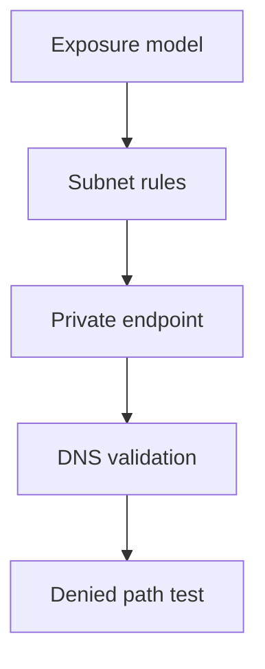

---
content_sources:
  diagrams:
    - id: best-practices-networking-best-practices
      type: flowchart
      source: mslearn-adapted
      mslearn_url: https://learn.microsoft.com/en-us/azure/storage/common/storage-network-security
content_validation:
  status: verified
  last_reviewed: "2026-05-21"
  reviewer: ai-agent
  core_claims:
    - claim: "Treat Storage networking as a DNS and access-boundary design, not only as a firewall toggle"
      source: https://learn.microsoft.com/en-us/azure/storage/common/storage-network-security
      verified: true
    - claim: "A private endpoint rollout breaks production because clients still resolve public endpoints. The network design must validate DNS, subresources, and fallback behavior first"
      source: https://learn.microsoft.com/en-us/azure/storage/common/storage-network-security
      verified: true
---

# Networking Best Practices

Treat Storage networking as a DNS and access-boundary design, not only as a firewall toggle.

## Why This Matters

A private endpoint rollout breaks production because clients still resolve public endpoints. The network design must validate DNS, subresources, and fallback behavior first.

<!-- diagram-id: best-practices-networking-best-practices -->

```mermaid
flowchart TD
    A[Exposure model]
    B[Subnet rules]
    A --> B
    C[Private endpoint]
    B --> C
    D[DNS validation]
    C --> D
    E[Denied path test]
    D --> E
```

## Recommended Practices

### Practice 1: Define the public endpoint posture first

**Why**: Decide whether public network access is disabled, restricted by firewall, or temporarily allowed for migration.

**How**:

- Choose disabled, selected networks, or temporary public access before endpoint rollout.
- Record which clients still require public egress during migration.
- Verify the final state with allowed-path and denied-path tests.

### Practice 2: Create private endpoints per service subresource

**Why**: Blob, dfs, file, queue, table, and web endpoints can require separate planning.

**How**:

- List required subresources: blob, dfs, file, queue, table, and web.
- Create separate private endpoints for dfs and blob when Data Lake Gen2 clients use both endpoints.
- Review endpoint approval state and network interface placement after deployment.

### Practice 3: Validate DNS from every client network

**Why**: Private Link works only when clients resolve the storage FQDN to the private endpoint address.

**How**:

- Resolve the storage account FQDN from each application subnet and hybrid resolver path.
- Confirm private DNS zones are linked to all VNets that host clients.
- Do not disable public access until private resolution returns the endpoint private IP.

### Practice 4: Keep break-glass access explicit

**Why**: Emergency paths should be documented instead of leaving broad public rules in place.

**How**:

- Define the emergency access method, approver, and maximum duration.
- Avoid leaving broad IP allow rules as undocumented fallback.
- Log any temporary public access change in the incident timeline.

### CLI Validation Example

| Command | Purpose |
|---|---|
| `az storage account network-rule add` | Allows a known subnet through a storage firewall rule. |
| `az storage account update` | Disables or restricts public network access after private resolution is validated. |

```bash
az storage account network-rule add \
    --resource-group $RG \
    --account-name $STORAGE_NAME \
    --subnet $SUBNET_ID \
    --output json

az storage account update \
    --resource-group $RG \
    --name $STORAGE_NAME \
    --default-action Deny \
    --public-network-access Disabled \
    --output json
```

## Common Mistakes / Anti-Patterns

- Creating a private endpoint but leaving public access unrestricted.
- Missing the dfs private endpoint for Data Lake Gen2 clients.
- Testing DNS from the operator laptop instead of the application subnet.

## Validation Checklist

- Public network access mode is intentional.
- Private DNS zones are linked to all client VNets.
- Each required subresource has a private endpoint.
- Denied-path tests prove public access is blocked.

## See Also

- [Networking And Private Access](../platform/networking-and-private-access.md)
- [Use Private Endpoints](../operations/use-private-endpoints.md)
- [Storage Networking Cheatsheet](../reference/storage-networking-cheatsheet.md)

## Sources

- [Microsoft Learn: Networking Best Practices](https://learn.microsoft.com/en-us/azure/storage/common/storage-network-security)
