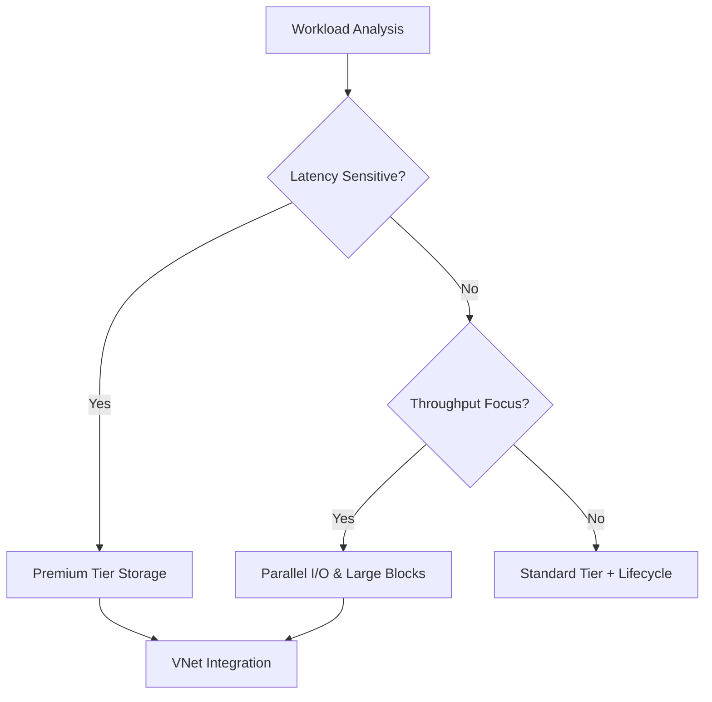

# Performance Best Practices

Optimize Azure Storage performance by matching workloads to service capabilities and request patterns.

## Performance Tuning Options

| Factor | Optimization |
|--------|--------------|
| Service Tier | Use Premium for sub-millisecond latency (Blobs, Files, Disks). |
| Parallelism | Use multiple threads for `Put Block` and `Get Blob` operations. |
| Object Size | Optimize request sizes (e.g., 4 MiB to 32 MiB blocks). |
| Hot Partitions | Distribute requests across blob names to avoid partition limits. |
| Caching | Use AzCopy or Azure File Sync to cache data near compute. |
| Networking | Keep storage and compute in the same Azure region. |

## Performance Optimization Flow

!!! tip
    When naming blobs, avoid sequential names like `image0001.jpg` if you expect high traffic. Using a hash prefix can help distribute load across partitions.

## Sources

- [Performance and scalability checklist](https://learn.microsoft.com/en-us/azure/storage/blobs/storage-performance-checklist)
- [Optimize blob storage performance](https://learn.microsoft.com/en-us/azure/storage/blobs/storage-blobs-introduction#performance-and-scalability)
- [Azure Files performance targets](https://learn.microsoft.com/en-us/azure/storage/files/storage-files-scale-targets)
