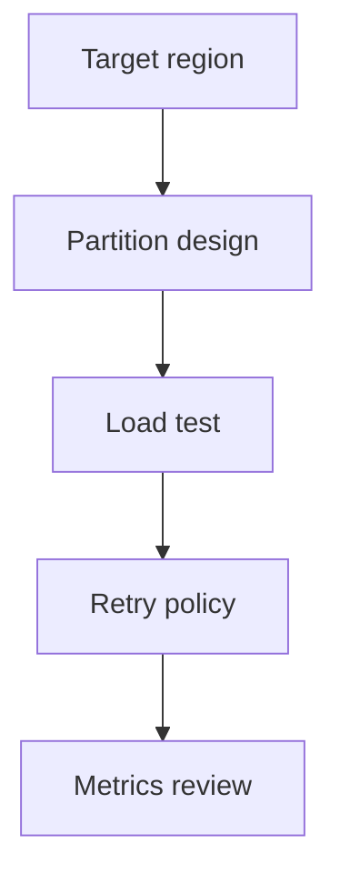

---
content_sources:
  diagrams:
    - id: best-practices-performance-best-practices
      type: flowchart
      source: mslearn-adapted
      mslearn_url: https://learn.microsoft.com/en-us/azure/storage/common/scalability-targets-standard-account
content_validation:
  status: verified
  last_reviewed: "2026-05-21"
  reviewer: ai-agent
  core_claims:
    - claim: "Validate throughput, latency, partition distribution, and client retry behavior against Azure Storage scale targets before go-live"
      source: https://learn.microsoft.com/en-us/azure/storage/common/scalability-targets-standard-account
      verified: true
    - claim: "A data ingestion job works in development but receives 503 Server Busy under production concurrency. Performance practice starts with measurement, not SKU changes alone"
      source: https://learn.microsoft.com/en-us/azure/storage/common/scalability-targets-standard-account
      verified: true
---

# Performance Best Practices

Validate throughput, latency, partition distribution, and client retry behavior against Azure Storage scale targets before go-live.

## Why This Matters

A data ingestion job works in development but receives 503 Server Busy under production concurrency. Performance practice starts with measurement, not SKU changes alone.

<!-- diagram-id: best-practices-performance-best-practices -->

```mermaid
flowchart TD
    A[Target region]
    B[Partition design]
    A --> B
    C[Load test]
    B --> C
    D[Retry policy]
    C --> D
    E[Metrics review]
    D --> E
```

## Recommended Practices

### Practice 1: Use region-specific account targets

**Why**: Listed GPv2 regions have higher default request, ingress, and egress targets than unlisted regions.

**How**:

- Compare the workload region against the Microsoft Learn standard account target table.
- Record whether the account is in a listed higher-target region such as Korea Central.
- Open a capacity or limit increase request only after workload testing proves the need.

### Practice 2: Avoid hot partitions

**Why**: Names and partition keys should distribute load for high-throughput Blob, Queue, and Table access.

**How**:

- Avoid sequential keys for high fan-in Blob and Table workloads.
- Distribute objects by tenant, time bucket, or hash where write concurrency is high.
- Watch 503 Server Busy, latency, and retry metrics during load tests.

### Practice 3: Tune clients with retry and concurrency

**Why**: Exponential backoff and measured parallelism are required for transient throttling.

**How**:

- Use exponential backoff for 500 and 503 responses.
- Increase concurrency gradually and stop when latency or throttling worsens.
- Keep retry budgets bounded so clients do not amplify incidents.

### Practice 4: Move to Premium only for measured needs

**Why**: Premium tiers should solve observed latency or IOPS requirements.

**How**:

- Collect latency, IOPS, and throughput evidence before changing SKU strategy.
- Use Premium BlockBlobStorage or Premium FileStorage for measured low-latency requirements.
- Avoid premium migrations when partitioning or client behavior is the actual bottleneck.

### CLI Validation Example

| Command | Purpose |
|---|---|
| `az storage account show` | Verifies SKU and region before comparing against scale targets. |
| `az monitor metrics list` | Reads transaction and bandwidth metrics for the account. |

```bash
az storage account show \
    --resource-group $RG \
    --name $STORAGE_NAME \
    --query "{name:name,location:primaryLocation,sku:sku.name,kind:kind}" \
    --output json

az monitor metrics list \
    --resource $(az storage account show --resource-group $RG --name $STORAGE_NAME --query id --output tsv) \
    --metric Transactions,Egress,Ingress \
    --interval PT1M \
    --output json
```

## Common Mistakes / Anti-Patterns

- Comparing Korea Central workloads against the lower unlisted-region GPv2 defaults.
- Increasing retries without backoff.
- Using one sequential blob prefix for high fan-in uploads.

## Validation Checklist

- Account region and target limits are recorded.
- Load tests use realistic object sizes and concurrency.
- Client retry policy uses exponential backoff.
- Metrics distinguish throttling, latency, and client-side network limits.

## See Also

- [Performance And Scaling Basics](../platform/performance-and-scaling-basics.md)
- [Performance Terms](../reference/performance-terms.md)
- [Storage Throttling](../troubleshooting/playbooks/storage-throttling.md)

## Sources

- [Microsoft Learn: Performance Best Practices](https://learn.microsoft.com/en-us/azure/storage/common/scalability-targets-standard-account)
