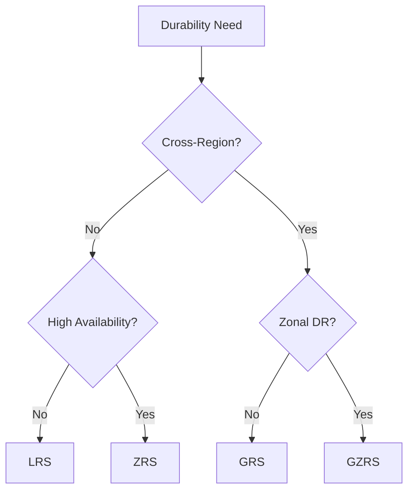

# Redundancy and DR Best Practices

Ensure data availability and durability by selecting the appropriate replication strategy.

## Redundancy Selection Guide

| Requirement | Option | Consideration |
|-------------|--------|---------------|
| Low cost / Single DC | LRS | Vulnerable to data center failure. |
| High availability in region | ZRS | Protects against single DC outage. |
| Regional disaster recovery | GRS/GZRS | Asynchronous replication to secondary region. |
| Read access during outage | RA-GRS | Allows reading from secondary during primary failure. |
| Compliance / 99.99999999999999% durability | GZRS | Maximum durability across zones and regions. |

## Redundancy Decision Flow

!!! warning
    Replication is not backup. Redundancy protects against hardware or facility failure, but it does not protect against accidental deletion or data corruption.

## See Also

- [Redundancy and Durability](../platform/redundancy-and-durability.md)
- [Redundancy Options](../reference/redundancy-options.md)
- [Data Protection and Recovery Issues](../troubleshooting/data-protection-and-recovery-issues.md)

## Sources

- [Azure Storage redundancy](https://learn.microsoft.com/en-us/azure/storage/common/storage-redundancy)
- [Disaster recovery and failover](https://learn.microsoft.com/en-us/azure/storage/common/storage-disaster-recovery-guidance)
- [Use RA-GRS for high availability](https://learn.microsoft.com/en-us/azure/storage/common/storage-designing-ha-apps-with-ragrs)
