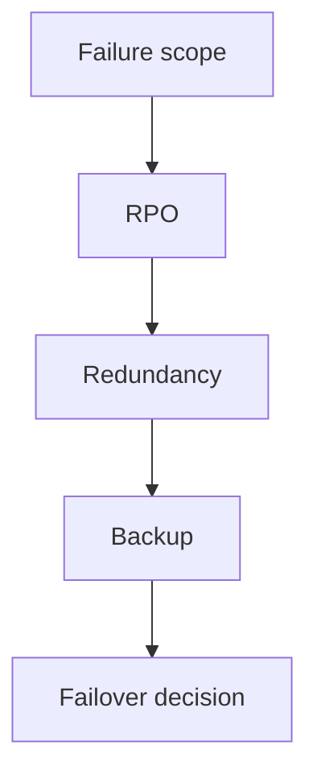

---
content_sources:
  diagrams:
    - id: best-practices-redundancy-and-dr-best-practices
      type: flowchart
      source: mslearn-adapted
      mslearn_url: https://learn.microsoft.com/en-us/azure/storage/common/storage-redundancy
content_validation:
  status: verified
  last_reviewed: "2026-05-21"
  reviewer: ai-agent
  core_claims:
    - claim: "Choose redundancy, backup, and failover patterns from recovery objectives instead of assuming replication is a complete DR plan"
      source: https://learn.microsoft.com/en-us/azure/storage/common/storage-redundancy
      verified: true
    - claim: "A team tells stakeholders that GRS means zero data loss. DR guidance separates durability, availability, failover, backup, and service-specific exceptions"
      source: https://learn.microsoft.com/en-us/azure/storage/common/storage-redundancy
      verified: true
---

# Redundancy and DR Best Practices

Choose redundancy, backup, and failover patterns from recovery objectives instead of assuming replication is a complete DR plan.

## Why This Matters

A team tells stakeholders that GRS means zero data loss. DR guidance separates durability, availability, failover, backup, and service-specific exceptions.

<!-- diagram-id: best-practices-redundancy-and-dr-best-practices -->

```mermaid
flowchart TD
    A[Failure scope]
    B[RPO]
    A --> B
    C[Redundancy]
    B --> C
    D[Backup]
    C --> D
    E[Failover decision]
    D --> E
```

## Recommended Practices

### Practice 1: Map redundancy to failure scope

**Why**: LRS, ZRS, GRS, and GZRS cover different datacenter, zone, and region events.

**How**:

- Use LRS for low-cost local durability, ZRS for zone events, and GRS or GZRS for regional durability.
- Check whether the selected service supports the desired redundancy option.
- Document what failure remains outside the redundancy model.

### Practice 2: Document asynchronous replication lag

**Why**: Geo-redundant storage can lose recent writes during failover.

**How**:

- Use Last Sync Time where available to reason about possible data loss.
- Set stakeholder expectations that geo-replication is not synchronous.
- Record write-freeze or quiesce steps for failover procedures.

### Practice 3: Handle Azure Files separately

**Why**: Azure Files does not support RA-GRS or RA-GZRS secondary reads.

**How**:

- Do not promise RA-GRS or RA-GZRS secondary reads for Azure Files.
- Use GRS or GZRS only for eligible HDD SMB shares that need geo-redundancy.
- Plan failover, remount, and client recovery steps for file-share workloads.

### Practice 4: Pair replication with backup

**Why**: Replication copies corruption and deletion unless data protection features are configured.

**How**:

- Enable soft delete, versioning, snapshots, or Azure Backup according to service type.
- Test restore separately from failover.
- Include deletion and corruption scenarios in DR exercises.

### CLI Validation Example

| Command | Purpose |
|---|---|
| `az storage account show` | Shows replication settings and failover status fields. |
| `az storage account failover` | Initiates failover only after an approved DR decision. |

```bash
az storage account show \
    --resource-group $RG \
    --name $STORAGE_NAME \
    --query "{sku:sku.name,primary:primaryLocation,secondary:secondaryLocation,lastSync:geoReplicationStats.lastSyncTime,status:geoReplicationStats.status}" \
    --output json

az storage account failover \
    --resource-group $RG \
    --name $STORAGE_NAME
```

## Common Mistakes / Anti-Patterns

- Using RA-GRS as a substitute for application failover design.
- Treating storage replication as backup.
- Ignoring Azure Files failover behavior and RA-GRS unsupported status.

## Validation Checklist

- RPO and RTO are approved by the data owner.
- Failover command execution requires incident approval.
- Azure Files guidance uses GRS or GZRS, not RA-GRS or RA-GZRS.
- Restore tests cover accidental deletion and corruption.

## See Also

- [Redundancy And Durability](../platform/redundancy-and-durability.md)
- [Redundancy Options](../reference/redundancy-options.md)
- [Backup And Data Protection](../operations/backup-and-data-protection.md)

## Sources

- [Microsoft Learn: Redundancy and DR Best Practices](https://learn.microsoft.com/en-us/azure/storage/common/storage-redundancy)
