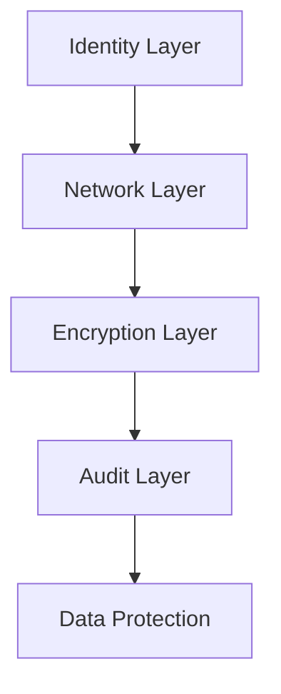

# Security Best Practices

Implement defense-in-depth security to protect your storage data from unauthorized access.

## Security Controls

| Control | Implementation | Tool |
|---------|----------------|------|
| Identity | Use Managed Identities for app access. | Azure RBAC |
| Access | Minimize Shared Key usage; rotate regularly. | Key Vault |
| SAS | Set short expiry; restrict IPs and protocols. | User Delegation SAS |
| Encryption | Use CMK with Key Vault for customer-controlled keys. Enable infrastructure encryption only when double encryption is required. | Azure Key Vault |
| Defense | Enable threat detection for suspicious access. | Defender for Storage |
| Networking | Disable public access; use firewall. | Private Endpoints |

## Security Layers

!!! note
    Azure RBAC is the primary method for controlling data access. Use Shared Access Signatures (SAS) only for granular, time-bound access where RBAC is not feasible.

## See Also

- [Access Models](../platform/access-models.md)
- [Configure Access and Identity](../operations/configure-access-and-identity.md)
- [Authorization Failures](../troubleshooting/authorization-failures.md)

## Sources

- [Azure Storage security guide](https://learn.microsoft.com/en-us/azure/storage/common/storage-security-guide)
- [User Delegation SAS](https://learn.microsoft.com/en-us/azure/storage/blobs/storage-blob-user-delegation-sas-create-dotnet)
- [Microsoft Defender for Storage](https://learn.microsoft.com/en-us/azure/defender-for-cloud/defender-for-storage-introduction)
