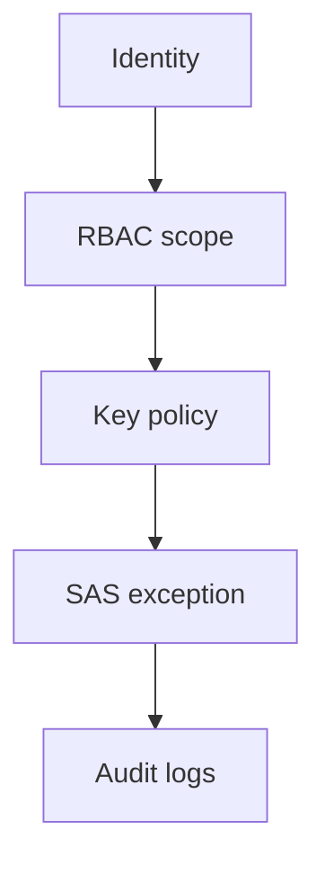

---
content_sources:
  diagrams:
    - id: best-practices-security-best-practices
      type: flowchart
      source: mslearn-adapted
      mslearn_url: https://learn.microsoft.com/en-us/azure/storage/common/storage-auth
content_validation:
  status: verified
  last_reviewed: "2026-05-21"
  reviewer: ai-agent
  core_claims:
    - claim: "Secure Azure Storage by combining identity-based access, key discipline, network controls, encryption defaults, and audit evidence"
      source: https://learn.microsoft.com/en-us/azure/storage/common/storage-auth
      verified: true
    - claim: "An application team uses a long-lived SAS in build logs. Security guidance replaces that pattern with RBAC, user delegation SAS where needed, and diagnostics"
      source: https://learn.microsoft.com/en-us/azure/storage/common/storage-auth
      verified: true
---

# Security Best Practices

Secure Azure Storage by combining identity-based access, key discipline, network controls, encryption defaults, and audit evidence.

## Why This Matters

An application team uses a long-lived SAS in build logs. Security guidance replaces that pattern with RBAC, user delegation SAS where needed, and diagnostics.

<!-- diagram-id: best-practices-security-best-practices -->

```mermaid
flowchart TD
    A[Identity]
    B[RBAC scope]
    A --> B
    C[Key policy]
    B --> C
    D[SAS exception]
    C --> D
    E[Audit logs]
    D --> E
```

## Recommended Practices

### Practice 1: Prefer Microsoft Entra ID for data access

**Why**: RBAC gives revocation, audit, and least-privilege scoping that account keys cannot provide.

**How**:

- Assign data-plane roles such as Storage Blob Data Reader or Contributor instead of broad control-plane roles.
- Use managed identities for applications running on Azure services.
- Audit role assignments at account, container, and share scopes.

### Practice 2: Disable Shared Key when workloads support it

**Why**: This blocks account-key based authorization and forces modern identity paths.

**How**:

- Inventory scripts and apps that still use account keys before changing the account policy.
- Disable Shared Key only after identity-based access paths have been tested.
- Keep exceptions documented with an owner and retirement date.

### Practice 3: Use short-lived scoped SAS only by exception

**Why**: SAS tokens are bearer credentials and should have narrow permissions and expiry.

**How**:

- Set expiry, permissions, protocol, and IP restrictions for every SAS token.
- Prefer read-only or write-only permissions instead of broad `racwdl` grants.
- Rotate or revoke SAS usage when ownership or business purpose changes.

### Practice 4: Collect authorization failures

**Why**: Logs are required to distinguish missing RBAC, invalid SAS, network deny, and key policy issues.

**How**:

- Enable diagnostic logs for the storage services in use.
- Correlate 403 responses with identity, SAS, Shared Key, and network decisions.
- Keep sample failed and successful requests in the incident record.

### CLI Validation Example

| Command | Purpose |
|---|---|
| `az storage account update` | Disables Shared Key authorization for compatible workloads. |
| `az role assignment create` | Grants data-plane access at the storage account scope. |

```bash
az storage account update \
    --resource-group $RG \
    --name $STORAGE_NAME \
    --allow-shared-key-access false \
    --output json

az role assignment create \
    --assignee-object-id $PRINCIPAL_ID \
    --assignee-principal-type ServicePrincipal \
    --role "Storage Blob Data Contributor" \
    --scope $(az storage account show --resource-group $RG --name $STORAGE_NAME --query id --output tsv) \
    --output json
```

## Common Mistakes / Anti-Patterns

- Embedding account keys in scripts or connection strings.
- Granting Storage Account Contributor for data access.
- Issuing SAS tokens without start time, expiry, IP, protocol, and permission review.

## Validation Checklist

- Shared Key is disabled or has an exception record.
- Data-plane RBAC scopes are least privilege.
- SAS use is logged with owner and expiry.
- Diagnostics are enabled for the services in use.

## See Also

- [Access Models](../platform/access-models.md)
- [Configure Access And Identity](../operations/configure-access-and-identity.md)
- [Authorization Failures](../troubleshooting/playbooks/security/authorization-failures.md)

## Sources

- [Microsoft Learn: Security Best Practices](https://learn.microsoft.com/en-us/azure/storage/common/storage-auth)
