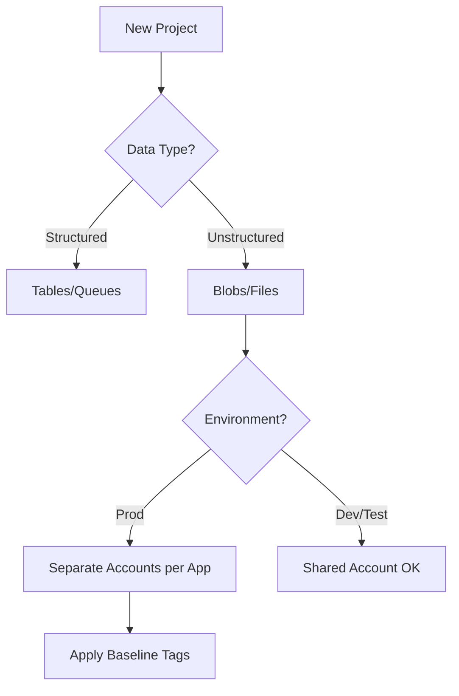

# Storage Account Design Baseline

Establishing a solid foundation for Azure Storage accounts ensures scalability, security, and cost-efficiency.

## Baseline Checklist

| Category | Best Practice |
|----------|---------------|
| Naming | Use unique, descriptive names; avoid sensitive info. |
| Region | Deploy in the same region as the consuming application. |
| Redundancy | Select based on RPO/RTO requirements (LRS, GRS, ZRS). |
| Access | Enable "Allow blob public access" only if required. |
| Networking | Use Private Endpoints for production workloads. |
| Monitoring | Enable Diagnostic Settings for storage logs. |

## Account Design Decision Flow

!!! note
    Separate storage accounts by purpose (e.g., application data vs. diagnostic logs) to simplify cost tracking and security boundary management.

## See Also

- [Storage Account Basics](../platform/storage-account-basics.md)
- [Create a Storage Account](../operations/create-storage-account.md)
- [Security Best Practices](security-best-practices.md)

## Sources

- [Storage account overview](https://learn.microsoft.com/en-us/azure/storage/common/storage-account-overview)
- [Naming conventions](https://learn.microsoft.com/en-us/azure/azure-resource-manager/management/resource-name-rules#microsoftstorage)
- [Azure Storage redundancy](https://learn.microsoft.com/en-us/azure/storage/common/storage-redundancy)
