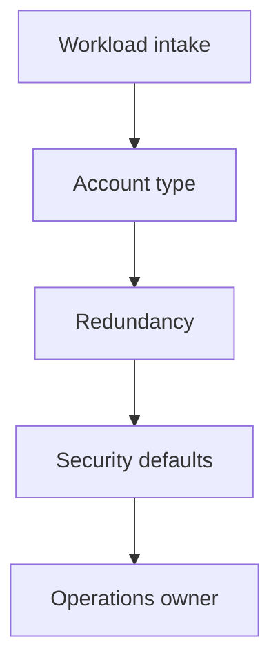

---
content_sources:
  diagrams:
    - id: best-practices-storage-account-design-baseline
      type: flowchart
      source: mslearn-adapted
      mslearn_url: https://learn.microsoft.com/en-us/azure/storage/common/storage-account-overview
content_validation:
  status: verified
  last_reviewed: "2026-05-21"
  reviewer: ai-agent
  core_claims:
    - claim: "Use this baseline to choose account type, redundancy, access posture, and ownership before a workload reaches production"
      source: https://learn.microsoft.com/en-us/azure/storage/common/storage-account-overview
      verified: true
    - claim: "A platform team owns dozens of accounts created by different projects. The baseline makes account creation reviewable before teams add containers, shares, or private endpoints"
      source: https://learn.microsoft.com/en-us/azure/storage/common/storage-account-overview
      verified: true
---

# Storage Account Design Baseline

Use this baseline to choose account type, redundancy, access posture, and ownership before a workload reaches production.

## Why This Matters

A platform team owns dozens of accounts created by different projects. The baseline makes account creation reviewable before teams add containers, shares, or private endpoints.

<!-- diagram-id: best-practices-storage-account-design-baseline -->

```mermaid
flowchart TD
    A[Workload intake]
    B[Account type]
    A --> B
    C[Redundancy]
    B --> C
    D[Security defaults]
    C --> D
    E[Operations owner]
    D --> E
```

## Recommended Practices

### Practice 1: Classify the workload before selecting the account type

**Why**: Blob, Files, Queue, Table, Data Lake, and premium workloads have different account and feature requirements.

**How**:

- List the required data services: Blob, Files, Queue, Table, Data Lake Storage, or a premium-only workload.
- Check feature compatibility before choosing account kind, especially HNS, premium tiers, lifecycle management, and private endpoints.
- Record the selected account type with one rejected alternative so later reviewers know the tradeoff.

### Practice 2: Choose redundancy from the recovery requirement

**Why**: LRS, ZRS, GRS, and GZRS protect different failure scopes and do not replace backup.

**How**:

- Write the required RPO, RTO, and failure scope before selecting LRS, ZRS, GRS, or GZRS.
- Confirm whether the workload needs zone resilience, regional durability, or both.
- Pair redundancy with backup and restore controls for deletion, corruption, and ransomware scenarios.

### Practice 3: Disable public-by-default behaviors

**Why**: Private access, HTTPS-only traffic, TLS 1.2 or later, and blocked anonymous blob access should be deliberate defaults.

**How**:

- Set anonymous blob access off unless the workload is a reviewed public website scenario.
- Use default deny firewall rules or private endpoints before production data is written.
- Keep any public network exception time-bound and tied to a named owner.

### Practice 4: Tag ownership and data classification

**Why**: Storage accounts often outlive the app that created them unless owner, cost center, and data class are explicit.

**How**:

- Require owner, workload, environment, and data classification tags at account creation.
- Use tags to route cost review and incident ownership.
- Review untagged accounts during monthly governance checks.

### CLI Validation Example

| Command | Purpose |
|---|---|
| `az storage account create` | Creates a GPv2 account with secure baseline settings. |
| `az storage account show` | Verifies SKU, HTTPS, public access, and network defaults. |

```bash
az storage account create \
    --resource-group $RG \
    --name $STORAGE_NAME \
    --location $LOCATION \
    --sku Standard_ZRS \
    --kind StorageV2 \
    --access-tier Hot \
    --allow-blob-public-access false \
    --min-tls-version TLS1_2 \
    --https-only true \
    --default-action Deny \
    --output json

az storage account show \
    --resource-group $RG \
    --name $STORAGE_NAME \
    --query "{name:name,sku:sku.name,httpsOnly:enableHttpsTrafficOnly,publicBlob:allowBlobPublicAccess,defaultAction:networkRuleSet.defaultAction}" \
    --output json
```

## Common Mistakes / Anti-Patterns

- Creating one shared account for unrelated data classes.
- Selecting geo-redundancy without documenting failover and data-loss tolerance.
- Leaving Shared Key and public network access enabled because the first test script used them.

## Validation Checklist

- Account kind and SKU match the workload.
- Region, redundancy, and paired-region impact are documented.
- Owner, data class, and retention tags are present.
- Diagnostics and alert ownership exist before production traffic.

## See Also

- [Storage Account Basics](../platform/storage-account-basics.md)
- [Create Storage Account](../operations/create-storage-account.md)
- [Storage Service Selection Guide](../reference/storage-service-selection-guide.md)

## Sources

- [Microsoft Learn: Storage Account Design Baseline](https://learn.microsoft.com/en-us/azure/storage/common/storage-account-overview)
