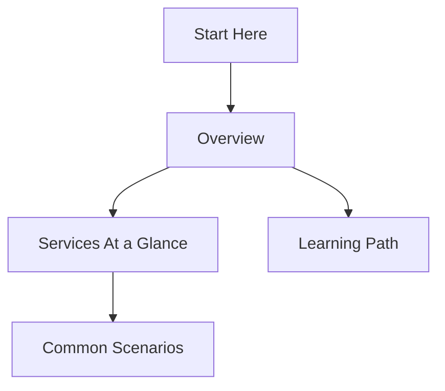

---
content_sources:
  diagrams:
    - id: index
      type: flowchart
      source: mslearn-adapted
      mslearn_url: https://learn.microsoft.com/en-us/azure/storage/
---

# Azure Storage Practical Guide

Welcome to the Azure Storage Practical Guide. This resource provides technical patterns and implementation strategies for Azure Storage services.

## Navigation Hub

| Section | Description |
| ------- | ----------- |
| [Start Here](start-here/index.md) | Introduction and learning paths |
| [Overview](start-here/overview.md) | Key concepts and service dependencies |
| [Learning Path](start-here/learning-path.md) | Role-based guidance |
| [Services At a Glance](start-here/storage-services-at-a-glance.md) | Technical comparison of storage types |
| [Common Scenarios](start-here/common-scenarios.md) | Mapping business needs to solutions |

## Guide Structure

<!-- diagram-id: index -->

!!! tip
    Start with the Overview if you are new to Azure Storage, then follow the Learning Path specific to your professional role.

## Quick Links

- [Azure Storage documentation hub](https://learn.microsoft.com/en-us/azure/storage/)
- [Storage Explorer documentation](https://learn.microsoft.com/en-us/azure/storage/storage-explorer/vs-azure-tools-storage-manage-with-storage-explorer)
- [Azure CLI Storage Commands](https://learn.microsoft.com/en-us/cli/azure/storage)

## See Also

- [Overview](start-here/overview.md)
- [How Azure Storage Works](platform/how-azure-storage-works.md)
- [Storage Service Selection Guide](reference/storage-service-selection-guide.md)

## Sources

- [Azure Storage documentation](https://learn.microsoft.com/en-us/azure/storage/)
- [Introduction to Azure Storage](https://learn.microsoft.com/en-us/azure/storage/common/storage-introduction)
