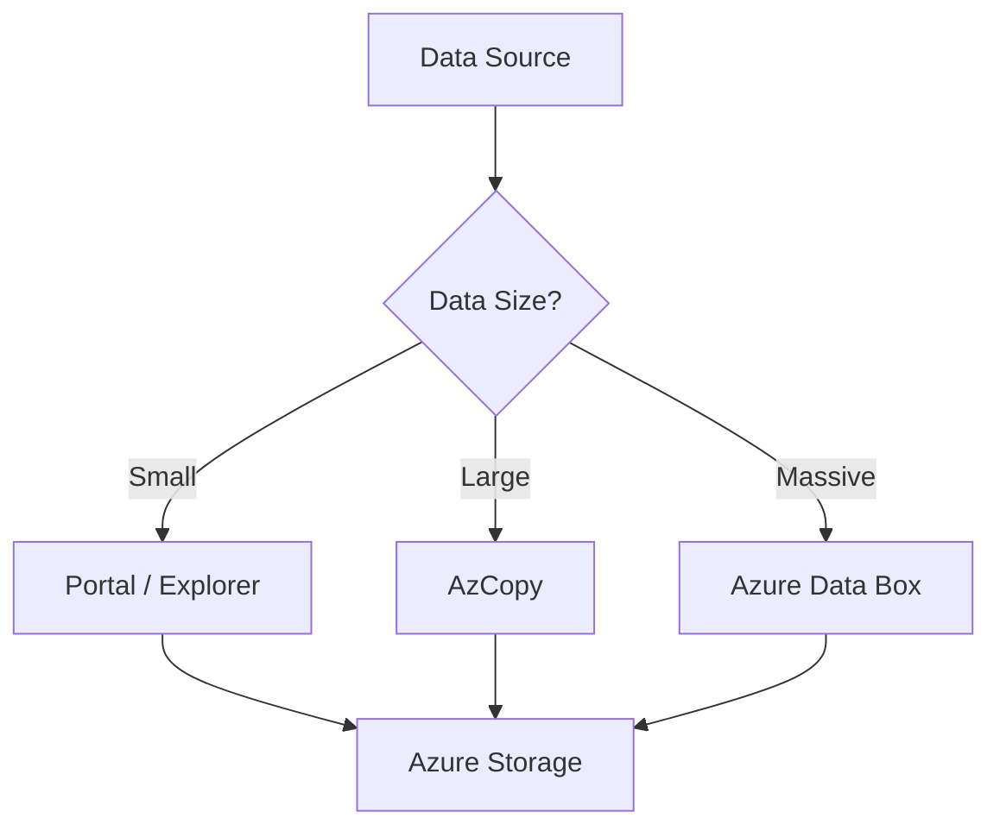

# AzCopy and Data Movement

Perform high-performance data transfers to and from Azure Storage.

| Tool | Format | Ideal Data Volume |
|------|--------|-------------------|
| AzCopy | Command Line | GB to TB |
| Storage Explorer | GUI | MB to GB |
| Data Box | Physical Device | 40TB to PB |
| Azure Portal | Web Interface | KB to MB |

!!! note
    AzCopy supports both Shared Access Signatures (SAS) and Azure Active Directory (Azure AD) for authentication.

## Transfer Checklist

- Choose authentication method: Azure AD or SAS.
- Benchmark upload and download throughput before cutover.
- Tune concurrency and block size for workload profile.
- Validate destination tier and metadata preservation.
- Use checksums and logs to confirm transfer integrity.
- Plan retry strategy for transient network failures.

## See Also

- [Manage Containers and Shares](manage-containers-and-shares.md)
- [Performance Best Practices](../best-practices/performance-best-practices.md)
- [Slow Upload / Download](../troubleshooting/playbooks/performance/slow-upload-download.md)

## Sources
- [Get started with AzCopy](https://learn.microsoft.com/en-us/azure/storage/common/storage-use-azcopy-v10)
- [Move data with Azure Data Box](https://learn.microsoft.com/en-us/azure/databox/data-box-overview)
