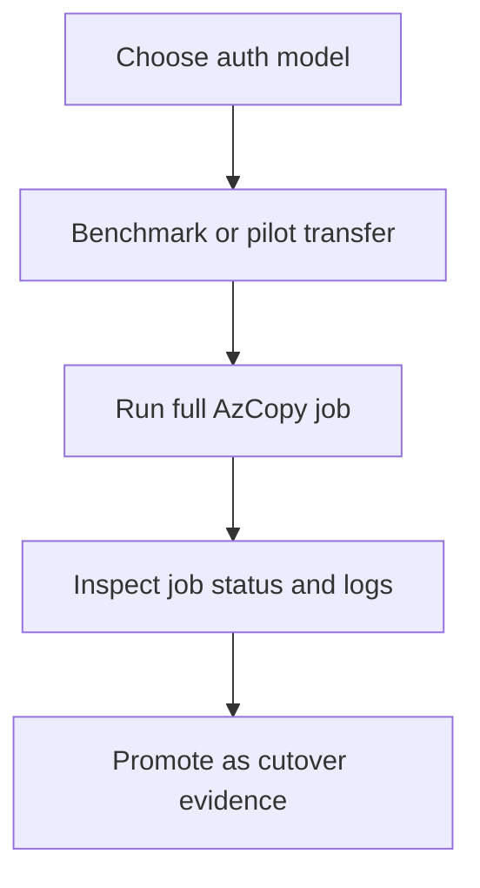

# AzCopy and Data Movement

Use this runbook for bulk uploads, downloads, inter-account copies, and migration cutovers where you need repeatable evidence instead of ad hoc portal transfers.

## Prerequisites

- AzCopy v10 installed and available in `PATH`.
- Source and destination endpoints plus either Entra auth or SAS tokens approved for the transfer.
- A dry-run path for testing the first copy before a production cutover.
- Sufficient network bandwidth and quota headroom on the target storage account.

## When to Use

- Migrating datasets into Azure Storage.
- Copying data between storage accounts for regional moves or recovery.
- Syncing a filesystem or blob prefix during an application cutover.

## Procedure

Authorize first, run a small validation copy, then launch the full transfer with job tracking and explicit performance settings.

<!-- diagram-id: operations-azcopy-and-data-movement -->

```mermaid
flowchart TD
    A[Choose auth model] --> B[Benchmark or pilot transfer]
    B --> C[Run full AzCopy job]
    C --> D[Inspect job status and logs]
    D --> E[Promote as cutover evidence]
```

```bash
export AZCOPY_CONCURRENCY_VALUE=AUTO
azcopy login
azcopy copy "/data/export" "https://$STG.blob.core.windows.net/app-data" --recursive=true --log-level=INFO
azcopy jobs list
```

Expected result:

- `azcopy login` completes successfully when you use Entra authorization.
- The copy command returns a job identifier and starts transferring objects.
- `azcopy jobs list` shows the active or completed job with transferred counts.

If you need a destination container first, create it explicitly:

```bash
az storage container create \
  --name app-data \
  --account-name $STG \
  --auth-mode login \
  --public-access off
```
| Command | Purpose |
| --- | --- |
| `az storage container create` | Create the blob container that AzCopy will target. |
| `--name` | Specify the destination container name. |
| `--account-name` | Specify the destination storage account. |
| `--auth-mode` | Use Microsoft Entra authorization for container creation. |
| `--public-access` | Keep the container private. |

## Verification

- Run `azcopy jobs show <job-id>` and confirm zero failed transfers.
- Sample a few destination paths with `az storage blob list --account-name $STG --container-name app-data --auth-mode login --output table` if the transfer targeted blobs.
- For large migrations, compare source and destination object counts before cutover.

## Rollback / Troubleshooting

- If throughput is poor, run `azcopy benchmark` against the target and tune concurrency before rerunning the full job.
- If the job fails on authorization, confirm whether the endpoint expects Entra auth or SAS and reauthenticate accordingly.
- If a sync or copy job targeted the wrong destination, stop the cutover and remove the incorrect data before retrying.
- If you need to restart after transient failure, use the stored job ID and `azcopy jobs resume <job-id>` instead of launching a fresh transfer blindly.

## See Also

- [Manage Containers and Shares](manage-containers-and-shares.md)
- [Performance Best Practices](../best-practices/performance-best-practices.md)
- [Slow Upload / Download](../troubleshooting/playbooks/performance/slow-upload-download.md)

## Sources

- [Copy or move data to Azure Storage by using AzCopy v10](https://learn.microsoft.com/en-us/azure/storage/common/storage-use-azcopy-v10)
- [Optimize the performance of AzCopy v10 with Azure Storage](https://learn.microsoft.com/en-us/azure/storage/common/storage-use-azcopy-optimize)
