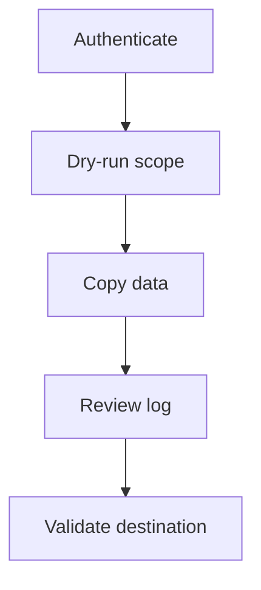

---
content_sources:
  diagrams:
    - id: operations-azcopy-and-data-movement
      type: flowchart
      source: mslearn-adapted
      mslearn_url: https://learn.microsoft.com/en-us/azure/storage/common/storage-use-azcopy-v10
content_validation:
  status: verified
  last_reviewed: "2026-05-21"
  reviewer: ai-agent
  core_claims:
    - claim: "Use AzCopy for repeatable high-throughput movement while preserving an auditable authentication and validation path"
      source: https://learn.microsoft.com/en-us/azure/storage/common/storage-use-azcopy-v10
      verified: true
    - claim: "Storage operations should include verification and rollback guidance before production use"
      source: https://learn.microsoft.com/en-us/azure/storage/common/storage-use-azcopy-v10
      verified: true
---

# AzCopy and Data Movement

Use AzCopy for repeatable high-throughput movement while preserving an auditable authentication and validation path.

<!-- diagram-id: operations-azcopy-and-data-movement -->

```mermaid
flowchart TD
    A[Authenticate]
    B[Dry-run scope]
    A --> B
    C[Copy data]
    B --> C
    D[Review log]
    C --> D
    E[Validate destination]
    D --> E
```

## Prerequisites

- Azure CLI authenticated to the correct tenant and subscription.
- Variables such as `$RG`, `$LOCATION`, `$STORAGE_NAME`, and workload-specific names are set.
- Operator has the control-plane and data-plane roles required for the task.
- A rollback owner is available for changes that affect production access.

## When to Use

- Uploading or downloading large datasets.
- Testing migration throughput before a cutover.

## Procedure

| Command | Purpose |
|---|---|
| `azcopy login` | Authenticates AzCopy with Microsoft Entra ID. |
| `azcopy copy` | Copies local data to a Blob container recursively. |

```bash
azcopy login --tenant-id $TENANT_ID

azcopy copy "$SOURCE_PATH" "https://$STORAGE_NAME.blob.core.windows.net/$CONTAINER_NAME" \
    --recursive=true \
    --check-length=true \
    --cap-mbps=800
```

## Verification

| Command | Purpose |
|---|---|
| `verification command` | Confirms that the intended configuration is active after the procedure. |

```bash
az storage blob list \
    --account-name $STORAGE_NAME \
    --container-name $CONTAINER_NAME \
    --auth-mode login \
    --num-results 10 \
    --output table
```

## Rollback / Troubleshooting

- If access fails, check identity assignment, network rules, and DNS before changing data-plane permissions.
- If a change blocks production traffic, restore the previous firewall or public-network setting only for the approved recovery window.
- Capture command output and Azure Activity Log entries for incident notes.

## See Also

- [Performance Best Practices](../best-practices/performance-best-practices.md)
- [Slow Upload Download](../troubleshooting/playbooks/performance/slow-upload-download.md)
- [Performance Terms](../reference/performance-terms.md)

## Sources

- [Microsoft Learn: AzCopy and Data Movement](https://learn.microsoft.com/en-us/azure/storage/common/storage-use-azcopy-v10)
