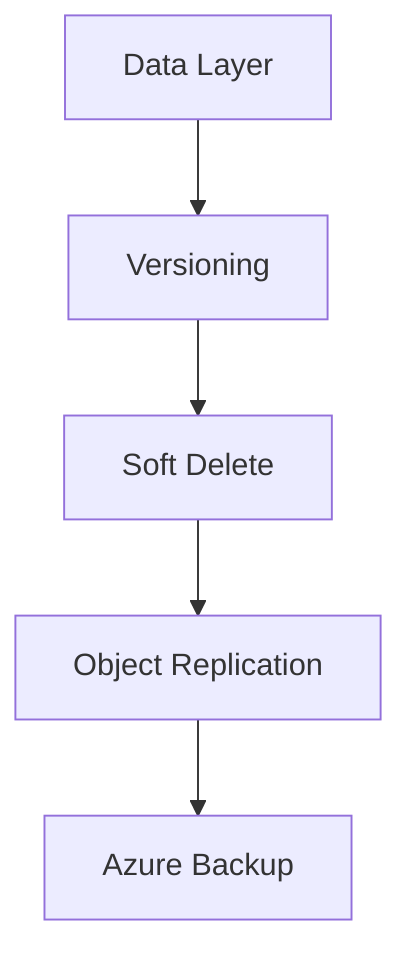

# Backup and Data Protection

Ensure data durability and availability using layered protection features.

| Feature | Scope | Purpose |
|---------|-------|---------|
| Soft Delete | Container/Blob | Protect against accidental deletion. |
| Versioning | Blob | Maintain history of blob changes. |
| PIT Restore | Account | Recover to a specific point in time. |
| Azure Backup | Account | Centrally managed off-site protection. |

!!! note
    Enable soft delete as a minimum protection layer for all production storage accounts.

## Sources
- [Data protection overview](https://learn.microsoft.com/en-us/azure/storage/blobs/data-protection-overview)
- [Soft delete for blobs](https://learn.microsoft.com/en-us/azure/storage/blobs/soft-delete-blob-overview)
