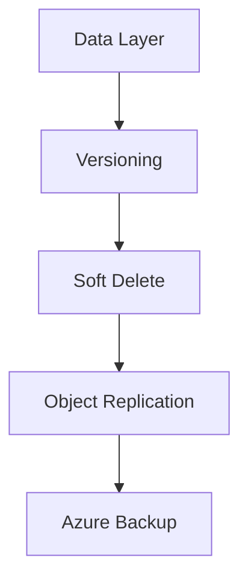

---
hide:
  - toc
---

# Backup and Data Protection

Ensure data durability and availability using layered protection features.

| Feature | Scope | Purpose |
|---------|-------|---------|
| Soft Delete | Container/Blob | Protect against accidental deletion. |
| Versioning | Blob | Maintain history of blob changes. |
| PIT Restore | Standard GPv2, block blobs, hot/cool only | Revert blob data to a specific point in time. Not supported for HNS-enabled (Data Lake Gen2) accounts. |
| Azure Backup | Blob containers / Azure Files | Operational or vaulted backup for blob data and file shares. |

!!! note
    Enable soft delete as a minimum protection layer for all production storage accounts.

Note: Point-in-time restore applies to Standard GPv2 accounts with block blobs in hot/cool tiers only, and is not supported for HNS-enabled (Data Lake Gen2) accounts. Azure Backup also supports Azure Files through file share snapshots in a Recovery Services vault.

## Protection Validation Checklist

- Enable soft delete for blobs and containers.
- Enable versioning for rollback-ready object history.
- Configure retention windows aligned to policy requirements.
- Validate restore flow in a non-production account.
- Confirm backup coverage for critical datasets.
- Monitor deletion and restore events through diagnostics.

## See Also

- [Redundancy and DR Best Practices](../best-practices/redundancy-and-dr-best-practices.md)
- [Data Protection and Recovery Issues](../troubleshooting/playbooks/performance/data-protection-and-recovery-issues.md)
- [Redundancy and Durability](../platform/redundancy-and-durability.md)

## Sources
- [Data protection overview](https://learn.microsoft.com/en-us/azure/storage/blobs/data-protection-overview)
- [Soft delete for blobs](https://learn.microsoft.com/en-us/azure/storage/blobs/soft-delete-blob-overview)
