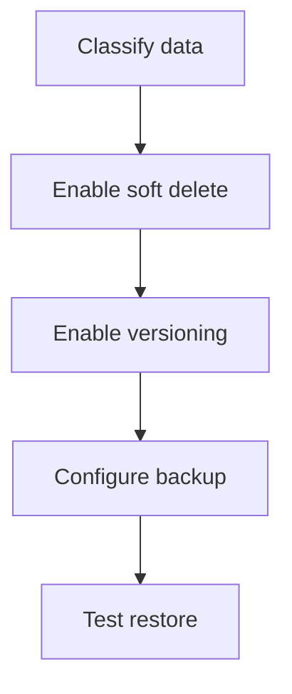

---
content_sources:
  diagrams:
    - id: operations-backup-and-data-protection
      type: flowchart
      source: mslearn-adapted
      mslearn_url: https://learn.microsoft.com/en-us/azure/storage/blobs/data-protection-overview
content_validation:
  status: verified
  last_reviewed: "2026-05-21"
  reviewer: ai-agent
  core_claims:
    - claim: "Enable recoverability features that protect data from deletion, overwrite, corruption, and operational mistakes"
      source: https://learn.microsoft.com/en-us/azure/storage/blobs/data-protection-overview
      verified: true
    - claim: "Storage operations should include verification and rollback guidance before production use"
      source: https://learn.microsoft.com/en-us/azure/storage/blobs/data-protection-overview
      verified: true
---

# Backup and Data Protection

Enable recoverability features that protect data from deletion, overwrite, corruption, and operational mistakes.

<!-- diagram-id: operations-backup-and-data-protection -->

```mermaid
flowchart TD
    A[Classify data]
    B[Enable soft delete]
    A --> B
    C[Enable versioning]
    B --> C
    D[Configure backup]
    C --> D
    E[Test restore]
    D --> E
```

## Prerequisites

- Azure CLI authenticated to the correct tenant and subscription.
- Variables such as `$RG`, `$LOCATION`, `$STORAGE_NAME`, and workload-specific names are set.
- Operator has the control-plane and data-plane roles required for the task.
- A rollback owner is available for changes that affect production access.

## When to Use

- Protecting Blob data beyond storage replication.
- Preparing Azure Files or Blob restore procedures for production.

## Procedure

| Command | Purpose |
|---|---|
| `az storage account blob-service-properties update` | Enables blob and container soft delete plus versioning. |
| `az storage account blob-service-properties show` | Verifies configured protection settings. |

```bash
az storage account blob-service-properties update \
    --resource-group $RG \
    --account-name $STORAGE_NAME \
    --enable-delete-retention true \
    --delete-retention-days 30 \
    --enable-container-delete-retention true \
    --container-delete-retention-days 30 \
    --enable-versioning true \
    --output json

az storage account blob-service-properties show \
    --resource-group $RG \
    --account-name $STORAGE_NAME \
    --query "{deleteRetention:deleteRetentionPolicy,containerDeleteRetention:containerDeleteRetentionPolicy,versioning:isVersioningEnabled}" \
    --output json
```

## Verification

| Command | Purpose |
|---|---|
| `verification command` | Confirms that the intended configuration is active after the procedure. |

```bash
az storage account blob-service-properties show \
    --resource-group $RG \
    --account-name $STORAGE_NAME \
    --output json
```

## Rollback / Troubleshooting

- If access fails, check identity assignment, network rules, and DNS before changing data-plane permissions.
- If a change blocks production traffic, restore the previous firewall or public-network setting only for the approved recovery window.
- Capture command output and Azure Activity Log entries for incident notes.

## See Also

- [Redundancy And Durability](../platform/redundancy-and-durability.md)
- [Redundancy And Dr Best Practices](../best-practices/redundancy-and-dr-best-practices.md)
- [Data Protection And Recovery Issues](../troubleshooting/playbooks/performance/data-protection-and-recovery-issues.md)

## Sources

- [Microsoft Learn: Backup and Data Protection](https://learn.microsoft.com/en-us/azure/storage/blobs/data-protection-overview)
