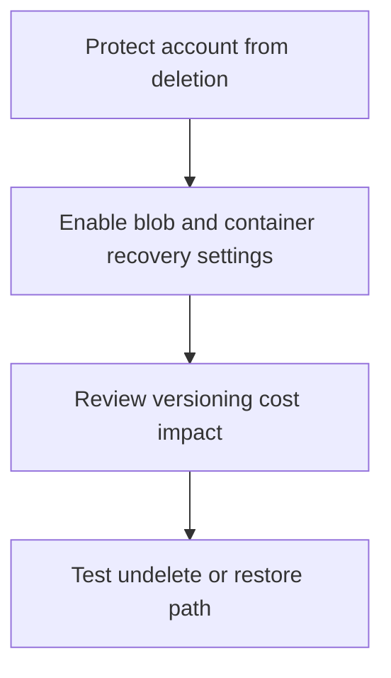

# Backup and Data Protection

Use this runbook to enable the recovery controls that must already be in place before an operator needs to recover from accidental deletes or overwrites.

## Prerequisites

- Storage account `$STG`, resource group `$RG`, and retention decisions for blobs, containers, and file shares.
- Approval for any feature that increases storage or transaction cost, such as versioning.
- A test container or non-production dataset where you can prove restore behavior before declaring the control ready.

## When to Use

- Hardening a new production storage account.
- Remediating an account that lacks delete protection.
- Preparing for audit evidence that recovery controls are both enabled and tested.

## Procedure

Enable the account-level lock first, then turn on the data protection features that match the workload and retention objective.

<!-- diagram-id: operations-backup-and-data-protection -->

```mermaid
flowchart TD
    A[Protect account from deletion] --> B[Enable blob and container recovery settings]
    B --> C[Review versioning cost impact]
    C --> D[Test undelete or restore path]
```

```bash
az lock create \
  --name protect-storage-account \
  --lock-type CanNotDelete \
  --resource-group $RG \
  --resource-name $STG \
  --resource-type Microsoft.Storage/storageAccounts && \
az storage account blob-service-properties update \
  --account-name $STG \
  --resource-group $RG \
  --enable-container-delete-retention true \
  --container-delete-retention-days 14 \
  --enable-delete-retention true \
  --delete-retention-days 14 \
  --enable-versioning true && \
az storage account blob-service-properties show \
  --account-name $STG \
  --resource-group $RG \
  --output json
```
| Command | Purpose |
| --- | --- |
| `az lock create` | Add an account-level resource lock to prevent accidental deletion. |
| `--name` | Name the lock or storage account resource being acted on. |
| `--lock-type` | Choose a delete-protection lock type. |
| `--resource-group` | Scope the lock and blob-service operations to the correct resource group. |
| `--resource-name` | Specify the storage account that receives the lock. |
| `--resource-type` | Target the storage account resource provider type for the lock. |
| `az storage account blob-service-properties update` | Enable blob/container recovery features on the storage account. |
| `--account-name` | Specify the storage account whose blob service is being configured. |
| `--enable-container-delete-retention` | Turn on container soft delete. |
| `--container-delete-retention-days` | Set the container soft-delete retention period. |
| `--enable-delete-retention` | Turn on blob soft delete. |
| `--delete-retention-days` | Set the blob soft-delete retention period. |
| `--enable-versioning` | Save previous blob versions when blobs are overwritten. |
| `az storage account blob-service-properties show` | Return the effective data-protection configuration. |
| `--output` | Emit JSON evidence for the change record. |

Expected result:

- The account has a `CanNotDelete` lock.
- Blob service properties show soft delete and versioning enabled with the configured retention days.
- The team has an explicit record of the cost-bearing features now active on the account.

## Verification

- Delete a test blob in a non-production container and verify it can be restored inside the retention window.
- Confirm the lock exists with `az lock list --resource-group $RG --output table`.
- Keep the JSON output from the blob service properties command as the control evidence.

## Rollback / Troubleshooting

- If versioning creates unacceptable cost growth, keep soft delete enabled and redesign lifecycle cleanup for old versions instead of disabling every protection feature.
- If the lock blocks an approved deletion workflow, remove it only for the change window and reapply it immediately after the operation completes.
- If restore testing fails, verify the object was deleted after soft delete was enabled and that the retention period has not expired.
- If the workload is Data Lake Storage Gen2 and versioning is not supported, use snapshots or other documented alternatives from the source guidance instead of forcing unsupported settings.

## See Also

- [Manage Lifecycle Policies](manage-lifecycle-policies.md)
- [Data Protection and Recovery Issues](../troubleshooting/playbooks/performance/data-protection-and-recovery-issues.md)
- [Redundancy and Durability](../platform/redundancy-and-durability.md)

## Sources

- [Data protection overview](https://learn.microsoft.com/en-us/azure/storage/blobs/data-protection-overview)
- [Soft delete for blobs](https://learn.microsoft.com/en-us/azure/storage/blobs/soft-delete-blob-overview)
