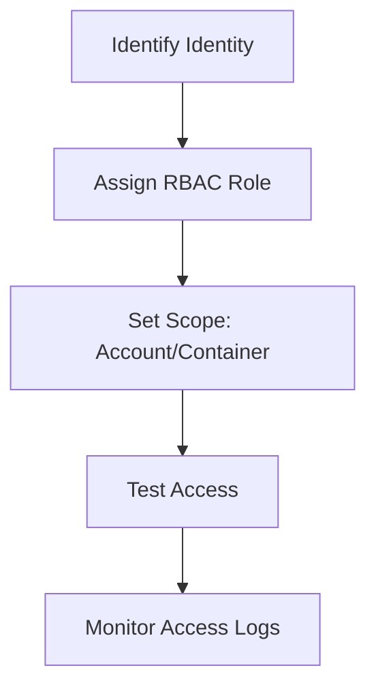

# Configure Access and Identity

Secure storage access using RBAC and identity-based controls.

| RBAC Role | Permissions | Use Case |
|-----------|-------------|----------|
| Storage Blob Data Reader | Read-only access to blobs. | Application read operations. |
| Storage Blob Data Contributor | Read/write/delete blobs. | Application data management. |
| Storage Blob Data Owner | Full control including RBAC. | Administrative management. |
| Storage Account Contributor | Manage account settings. | Infrastructure management. |

!!! warning
    Disable shared key access whenever possible to enforce modern identity-based authentication.

## Sources
- [Authorize access to storage](https://learn.microsoft.com/en-us/azure/storage/common/storage-auth)
- [Assign Azure roles for access](https://learn.microsoft.com/en-us/azure/storage/blobs/assign-azure-role-data-access)
