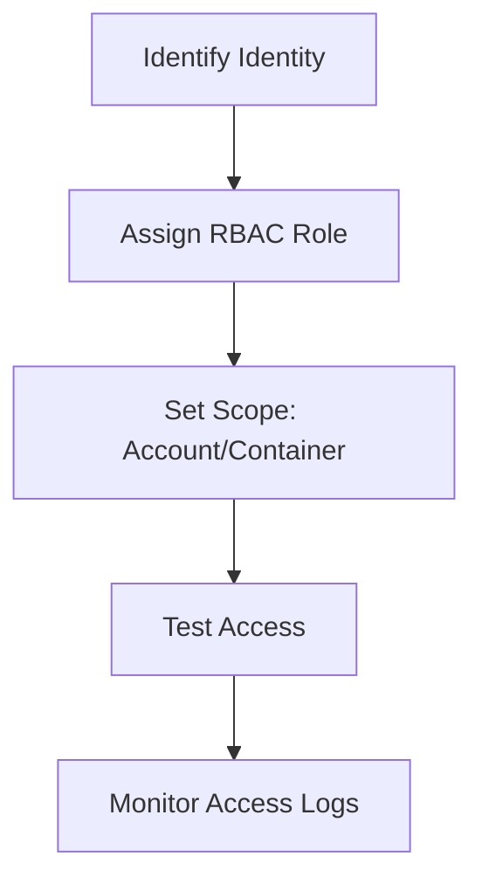

# Configure Access and Identity

Secure storage access using RBAC and identity-based controls.

| RBAC Role | Permissions | Use Case |
|-----------|-------------|----------|
| Storage Blob Data Reader | Read-only access to blobs. | Application read operations. |
| Storage Blob Data Contributor | Read/write/delete blobs. | Application data management. |
| Storage Blob Data Owner | Full access to blob containers and data; can set POSIX ACLs for HNS-enabled accounts. Does not grant RBAC role assignment. | Data ownership / ACL management. |
| Storage Account Contributor | Manage account settings. | Infrastructure management. |

!!! warning
    Disable shared key access whenever possible to enforce modern identity-based authentication.

## Access Validation Checklist

- Verify principal type: user, group, or managed identity.
- Assign data plane roles for data operations.
- Assign control plane roles only for resource management.
- Scope assignments to subscription, account, container, or share.
- Validate token audience and tenant alignment.
- Confirm diagnostics capture authorization failures.

## See Also

- [Access Models](../platform/access-models.md)
- [Security Best Practices](../best-practices/security-best-practices.md)
- [Authorization Failures](../troubleshooting/playbooks/security/authorization-failures.md)

## Sources
- [Authorize access to storage](https://learn.microsoft.com/en-us/azure/storage/common/storage-auth)
- [Assign Azure roles for access](https://learn.microsoft.com/en-us/azure/storage/blobs/assign-azure-role-data-access)
