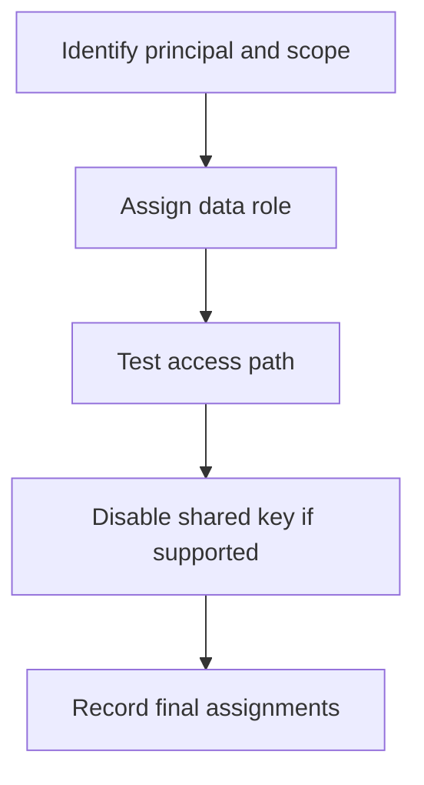

# Configure Access and Identity

Use this runbook to move a storage account toward least-privilege access with scoped RBAC assignments and reduced reliance on account keys.

## Prerequisites

- Storage account name in `$STG`, resource group in `$RG`, and target principal object ID in `$PRINCIPAL_ID`.
- Permission to create and remove Azure RBAC assignments.
- The exact container or account scope that the workload should access.
- Approval for any change that disables shared-key authorization.

## When to Use

- Onboarding an application or managed identity to blob access.
- Replacing broad account-key usage with role-based access.
- Tightening scope after finding an over-permissioned subscription or account assignment.

## Procedure

Assign the narrowest role at the lowest viable scope, then remove legacy access paths only after the new path is verified.

<!-- diagram-id: operations-configure-access-and-identity -->

```mermaid
flowchart TD
    A[Identify principal and scope] --> B[Assign data role]
    B --> C[Test access path]
    C --> D[Disable shared key if supported]
    D --> E[Record final assignments]
```

```bash
CONTAINER_SCOPE="/subscriptions/<subscription-id>/resourceGroups/$RG/providers/Microsoft.Storage/storageAccounts/$STG/blobServices/default/containers/app-data" && \
az role assignment create \
  --role "Storage Blob Data Contributor" \
  --assignee-object-id $PRINCIPAL_ID \
  --assignee-principal-type ServicePrincipal \
  --scope "$CONTAINER_SCOPE" && \
az storage account update \
  --name $STG \
  --resource-group $RG \
  --allow-shared-key-access false && \
az role assignment list \
  --scope "$CONTAINER_SCOPE" \
  --query "[].{principalId:principalId,role:roleDefinitionName,scope:scope}" \
  --output table
```
| Command | Purpose |
| --- | --- |
| `az role assignment create` | Grant the data-plane role to the target principal. |
| `--role` | Select the built-in least-privilege role needed by the workload. |
| `--assignee-object-id` | Identify the user, group, service principal, or managed identity. |
| `--assignee-principal-type` | Tell Azure which principal type is being assigned. |
| `--scope` | Limit the assignment to the container scope instead of the whole account when possible. |
| `az storage account update` | Update account-level authorization settings. |
| `--name` | Specify the storage account being hardened. |
| `--resource-group` | Scope the update to the correct storage account resource. |
| `--allow-shared-key-access` | Disable account-key authorization when the workload supports Entra access. |
| `az role assignment list` | Display the resulting assignments for evidence capture. |
| `--query` | Limit output to the role-assignment facts needed for review. |
| `--output` | Render a readable review table. |

Expected result:

- The role assignment is created at the container scope.
- `allowSharedKeyAccess` is `false` if all clients were prepared for Entra authorization.
- The evidence table shows the expected principal and role.

## Verification

Wait for role propagation, then confirm both the RBAC assignment and the storage-account setting.

```bash
az storage account show \
  --name $STG \
  --resource-group $RG \
  --query "{allowSharedKeyAccess:allowSharedKeyAccess,defaultToOAuthAuthentication:defaultToOAuthAuthentication}" \
  --output table
```
| Command | Purpose |
| --- | --- |
| `az storage account show` | Confirm the account-level authorization posture. |
| `--name` | Specify the storage account to inspect. |
| `--resource-group` | Scope the lookup to the correct resource group. |
| `--query` | Return only the identity-related settings that matter for the review. |
| `--output` | Render a compact verification table. |

Healthy evidence shows the intended role assignment, and workloads can authenticate without falling back to account keys. If the workload still sees authorization errors, allow up to 10 minutes for RBAC propagation before treating it as a failure.

## Rollback / Troubleshooting

- If an application breaks after disabling shared key, re-enable it temporarily with `az storage account update --name $STG --resource-group $RG --allow-shared-key-access true`, then fix the workload to use Entra credentials.
- If access is too broad, delete the assignment and recreate it at container scope instead of storage-account scope.
- If a user can browse in the portal but not read blob data, confirm they also have the required data role and not only a management-plane role.
- If the wrong principal received the role, remove it with `az role assignment delete --assignee-object-id $PRINCIPAL_ID --role "Storage Blob Data Contributor" --scope "$CONTAINER_SCOPE"`.

## See Also

- [Manage Containers and Shares](manage-containers-and-shares.md)
- [Authorization Failures](../troubleshooting/playbooks/security/authorization-failures.md)
- [Access Models](../platform/access-models.md)

## Sources

- [Authorize operations for data access](https://learn.microsoft.com/en-us/azure/storage/common/authorize-data-access)
- [Assign an Azure role for blob data access](https://learn.microsoft.com/en-us/azure/storage/blobs/assign-azure-role-data-access)
