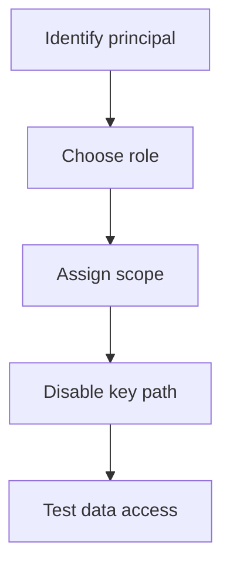

---
content_sources:
  diagrams:
    - id: operations-configure-access-and-identity
      type: flowchart
      source: mslearn-adapted
      mslearn_url: https://learn.microsoft.com/en-us/azure/storage/common/storage-auth
content_validation:
  status: verified
  last_reviewed: "2026-05-21"
  reviewer: ai-agent
  core_claims:
    - claim: "Configure Storage access with Microsoft Entra ID, scoped RBAC, and explicit Shared Key policy"
      source: https://learn.microsoft.com/en-us/azure/storage/common/storage-auth
      verified: true
    - claim: "Storage operations should include verification and rollback guidance before production use"
      source: https://learn.microsoft.com/en-us/azure/storage/common/storage-auth
      verified: true
---

# Configure Access and Identity

Configure Storage access with Microsoft Entra ID, scoped RBAC, and explicit Shared Key policy.

<!-- diagram-id: operations-configure-access-and-identity -->

```mermaid
flowchart TD
    A[Identify principal]
    B[Choose role]
    A --> B
    C[Assign scope]
    B --> C
    D[Disable key path]
    C --> D
    E[Test data access]
    D --> E
```

## Prerequisites

- Azure CLI authenticated to the correct tenant and subscription.
- Variables such as `$RG`, `$LOCATION`, `$STORAGE_NAME`, and workload-specific names are set.
- Operator has the control-plane and data-plane roles required for the task.
- A rollback owner is available for changes that affect production access.

## When to Use

- Granting application or operator access to Blob or Files data.
- Removing account-key dependencies before production.

## Procedure

| Command | Purpose |
|---|---|
| `az role assignment create` | Assigns a data-plane role to a managed identity or service principal. |
| `az storage account update` | Disables Shared Key authorization when supported. |

```bash
az role assignment create \
    --assignee-object-id $PRINCIPAL_ID \
    --assignee-principal-type ServicePrincipal \
    --role "Storage Blob Data Contributor" \
    --scope $(az storage account show --resource-group $RG --name $STORAGE_NAME --query id --output tsv) \
    --output json

az storage account update \
    --resource-group $RG \
    --name $STORAGE_NAME \
    --allow-shared-key-access false \
    --output json
```

## Verification

| Command | Purpose |
|---|---|
| `verification command` | Confirms that the intended configuration is active after the procedure. |

```bash
az role assignment list \
    --assignee $PRINCIPAL_ID \
    --scope $(az storage account show --resource-group $RG --name $STORAGE_NAME --query id --output tsv) \
    --output table

az storage account show \
    --resource-group $RG \
    --name $STORAGE_NAME \
    --query "{allowSharedKeyAccess:allowSharedKeyAccess}" \
    --output json
```

## Rollback / Troubleshooting

- If access fails, check identity assignment, network rules, and DNS before changing data-plane permissions.
- If a change blocks production traffic, restore the previous firewall or public-network setting only for the approved recovery window.
- Capture command output and Azure Activity Log entries for incident notes.

## See Also

- [Access Models](../platform/access-models.md)
- [Security Best Practices](../best-practices/security-best-practices.md)
- [Authorization Failures](../troubleshooting/playbooks/security/authorization-failures.md)

## Sources

- [Microsoft Learn: Configure Access and Identity](https://learn.microsoft.com/en-us/azure/storage/common/storage-auth)
