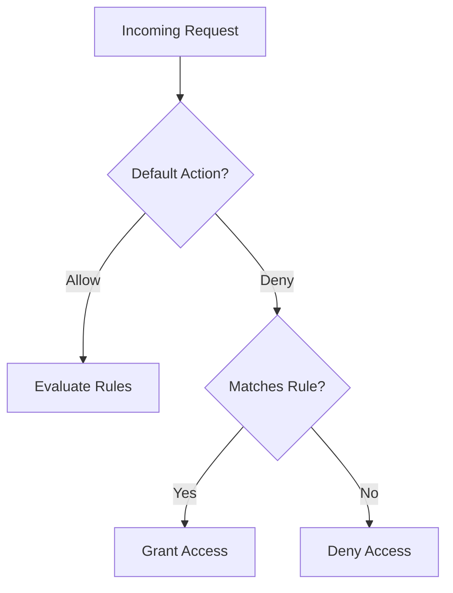

# Configure Network Rules

Control network access to your storage account using firewalls and VNets.

| Rule Type | Default Action | Configuration |
|-----------|----------------|---------------|
| Default Action | Allow or Deny | Controls non-matched traffic. |
| IP Rules | Allow IP/Range | Whitelist specific external IPs. |
| VNet Rules | Allow Subnet | Enable Service Endpoints. |
| Resource Instances | Allow Service | Grant specific Azure services. |

!!! warning
    Changing the default action to "Deny" immediately breaks all access not explicitly whitelisted.

## Sources
- [Configure Azure Storage firewalls](https://learn.microsoft.com/en-us/azure/storage/common/storage-network-security)
- [Manage virtual network rules](https://learn.microsoft.com/en-us/azure/storage/common/storage-network-security?tabs=azure-portal)
