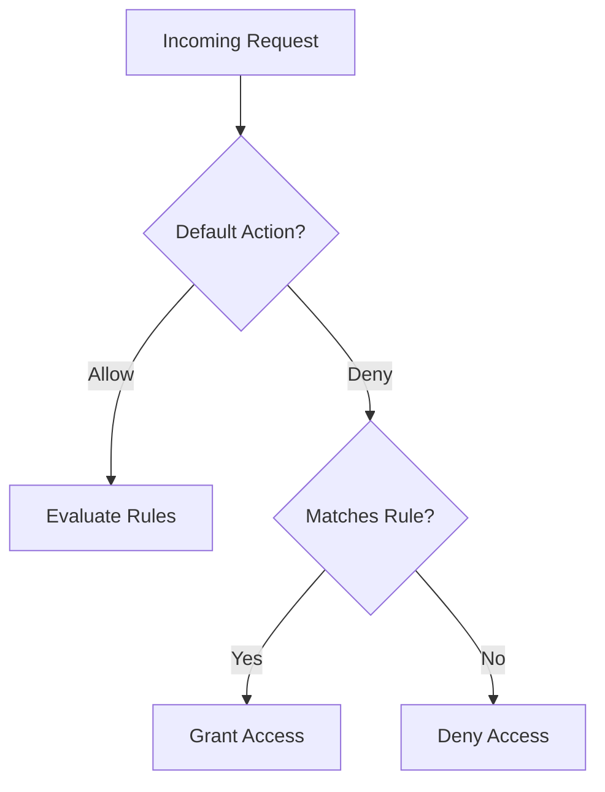

---
content_sources:
  diagrams:
    - id: operations-configure-network-rules
      type: flowchart
      source: mslearn-adapted
      mslearn_url: https://learn.microsoft.com/en-us/azure/storage/common/storage-network-security
---

# Configure Network Rules

Control network access to your storage account using firewalls and VNets.

| Rule Type | Default Action | Configuration |
|-----------|----------------|---------------|
| Default Action | Allow or Deny | Controls non-matched traffic. |
| IP Rules | Allow IP/Range | Whitelist specific external IPs. |
| VNet Rules | Allow Subnet | Enable Service Endpoints. |
| Resource Instances | Allow Service | Grant specific Azure services. |

!!! warning
    Changing the default action to "Deny" immediately breaks all access not explicitly whitelisted.

<!-- diagram-id: operations-configure-network-rules -->

## Rule Validation Checklist

- Confirm default action aligns with target exposure.
- Add trusted public IP ranges where required.
- Add subnet rules only after service endpoints validation.
- Validate resource instance exceptions if used.
- Confirm bypass settings for Azure services are intentional.
- Test access from approved and blocked networks.

## See Also

- [Networking and Private Access](../platform/networking-and-private-access.md)
- [Networking Best Practices](../best-practices/networking-best-practices.md)
- [Use Private Endpoints](use-private-endpoints.md)

## Sources
- [Configure Azure Storage firewalls](https://learn.microsoft.com/en-us/azure/storage/common/storage-network-security)
- [Manage virtual network rules](https://learn.microsoft.com/en-us/azure/storage/common/storage-network-security?tabs=azure-portal)
