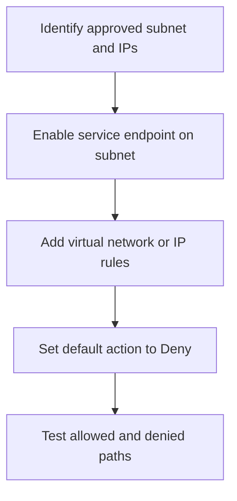

# Configure Network Rules

Use this runbook when you need to keep a public endpoint but restrict which networks can reach it.

## Prerequisites

- Storage account in `$STG`, resource group in `$RG`, VNet in `$VNET`, and subnet in `$SUBNET`.
- The subnet already planned for Azure Storage service endpoints, or a maintenance window to enable them.
- Public IP ranges approved for any on-premises or internet-facing allow rules.

## When to Use

- Moving a storage account from open public access to explicit allow lists.
- Allowing a controlled subnet or IP range without deploying Private Link.
- Reviewing firewall posture after an incident involving unexpected external access.

## Procedure

Add the allow rules first, then switch the default action to `Deny` only after the approved paths are in place.

<!-- diagram-id: operations-configure-network-rules -->

```mermaid
flowchart TD
    A[Identify approved subnet and IPs] --> B[Enable service endpoint on subnet]
    B --> C[Add virtual network or IP rules]
    C --> D[Set default action to Deny]
    D --> E[Test allowed and denied paths]
```

```bash
az network vnet subnet update \
  --resource-group $RG \
  --vnet-name $VNET \
  --name $SUBNET \
  --service-endpoints Microsoft.Storage && \
az storage account network-rule add \
  --resource-group $RG \
  --account-name $STG \
  --subnet $SUBNET \
  --vnet-name $VNET && \
az storage account network-rule add \
  --resource-group $RG \
  --account-name $STG \
  --ip-address 203.0.113.10 && \
az storage account update \
  --name $STG \
  --resource-group $RG \
  --default-action Deny
```
| Command | Purpose |
| --- | --- |
| `az network vnet subnet update` | Enable the subnet capability required for VNet-based storage firewall rules. |
| `--resource-group` | Identify the resource group that contains the virtual network or storage account. |
| `--vnet-name` | Specify the virtual network that hosts the approved subnet. |
| `--name` | Specify the target subnet or storage account, depending on the command being run. |
| `--service-endpoints` | Enable the Microsoft.Storage service endpoint on the subnet. |
| `az storage account network-rule add` | Add a network allow rule to the storage account. |
| `--account-name` | Specify the storage account whose firewall you are editing. |
| `--subnet` | Allow traffic from the named subnet. |
| `--ip-address` | Allow traffic from a specific public IP address. |
| `az storage account update` | Change the storage account firewall default behavior. |
| `--default-action` | Deny all traffic that does not match an explicit allow rule. |

Expected result:

- The subnet reports the `Microsoft.Storage` service endpoint.
- The storage account now contains the specific subnet and IP rules.
- The default action is `Deny`, so only approved paths reach the public endpoint.

## Verification

```bash
az storage account show \
  --name $STG \
  --resource-group $RG \
  --query "{defaultAction:networkRuleSet.defaultAction,ipRules:networkRuleSet.ipRules[].ipAddressOrRange,virtualNetworkRules:networkRuleSet.virtualNetworkRules[].virtualNetworkResourceId,bypass:networkRuleSet.bypass}" \
  --output json
```
| Command | Purpose |
| --- | --- |
| `az storage account show` | Inspect the resulting firewall configuration. |
| `--name` | Specify the storage account being verified. |
| `--resource-group` | Scope the query to the correct resource group. |
| `--query` | Return the effective network allow lists and default action. |
| `--output` | Emit JSON evidence for the change record. |

Healthy evidence shows `defaultAction` as `Deny` and includes the intended IP and subnet rules. From an approved client, requests should succeed. From an unapproved client, requests should fail with a 403.

## Rollback / Troubleshooting

- If approved application traffic breaks immediately, verify the subnet rule references the correct subnet and that the service endpoint is enabled.
- If an on-premises client still fails, confirm you allowed the egress NAT public IP, not the internal RFC1918 address.
- If a trusted Azure service unexpectedly loses access, review whether a trusted service exception or resource-instance rule is also required.
- To restore broad access during an outage, run `az storage account update --name $STG --resource-group $RG --default-action Allow`, then reapply the restrictive model after the root cause is fixed.

## See Also

- [Use Private Endpoints](use-private-endpoints.md)
- [Networking and Private Access](../platform/networking-and-private-access.md)
- [Networking Best Practices](../best-practices/networking-best-practices.md)

## Sources

- [Azure Storage firewall rules and network access](https://learn.microsoft.com/en-us/azure/storage/common/storage-network-security)
