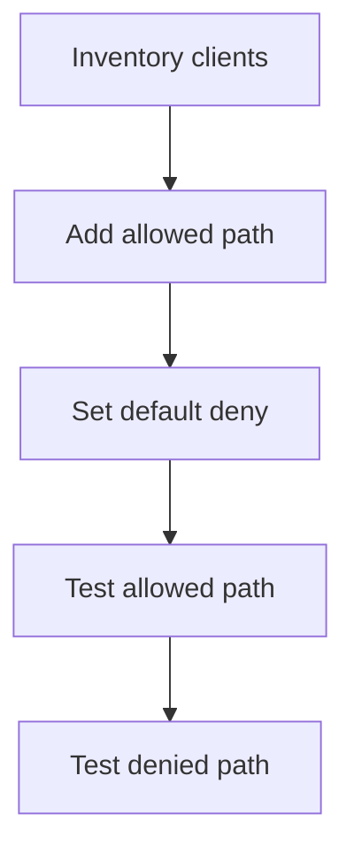

---
content_sources:
  diagrams:
    - id: operations-configure-network-rules
      type: flowchart
      source: mslearn-adapted
      mslearn_url: https://learn.microsoft.com/en-us/azure/storage/common/storage-network-security
content_validation:
  status: verified
  last_reviewed: "2026-05-21"
  reviewer: ai-agent
  core_claims:
    - claim: "Restrict storage account network access using firewall rules, subnet rules, and an explicit default action"
      source: https://learn.microsoft.com/en-us/azure/storage/common/storage-network-security
      verified: true
    - claim: "Storage operations should include verification and rollback guidance before production use"
      source: https://learn.microsoft.com/en-us/azure/storage/common/storage-network-security
      verified: true
---

# Configure Network Rules

Restrict storage account network access using firewall rules, subnet rules, and an explicit default action.

<!-- diagram-id: operations-configure-network-rules -->

```mermaid
flowchart TD
    A[Inventory clients]
    B[Add allowed path]
    A --> B
    C[Set default deny]
    B --> C
    D[Test allowed path]
    C --> D
    E[Test denied path]
    D --> E
```

## Prerequisites

- Azure CLI authenticated to the correct tenant and subscription.
- Variables such as `$RG`, `$LOCATION`, `$STORAGE_NAME`, and workload-specific names are set.
- Operator has the control-plane and data-plane roles required for the task.
- A rollback owner is available for changes that affect production access.

## When to Use

- Limiting a storage account to approved VNets or IP ranges.
- Preparing a migration toward private endpoint-only access.

## Procedure

| Command | Purpose |
|---|---|
| `az storage account network-rule add` | Adds a subnet or IP rule to the storage firewall. |
| `az storage account update` | Sets the account default action and public network access mode. |

```bash
az storage account network-rule add \
    --resource-group $RG \
    --account-name $STORAGE_NAME \
    --subnet $SUBNET_ID \
    --output json

az storage account update \
    --resource-group $RG \
    --name $STORAGE_NAME \
    --default-action Deny \
    --public-network-access Enabled \
    --output json
```

## Verification

| Command | Purpose |
|---|---|
| `verification command` | Confirms that the intended configuration is active after the procedure. |

```bash
az storage account show \
    --resource-group $RG \
    --name $STORAGE_NAME \
    --query "networkRuleSet" \
    --output json
```

## Rollback / Troubleshooting

- If access fails, check identity assignment, network rules, and DNS before changing data-plane permissions.
- If a change blocks production traffic, restore the previous firewall or public-network setting only for the approved recovery window.
- Capture command output and Azure Activity Log entries for incident notes.

## See Also

- [Networking And Private Access](../platform/networking-and-private-access.md)
- [Networking Best Practices](../best-practices/networking-best-practices.md)
- [Use Private Endpoints](use-private-endpoints.md)

## Sources

- [Microsoft Learn: Configure Network Rules](https://learn.microsoft.com/en-us/azure/storage/common/storage-network-security)
