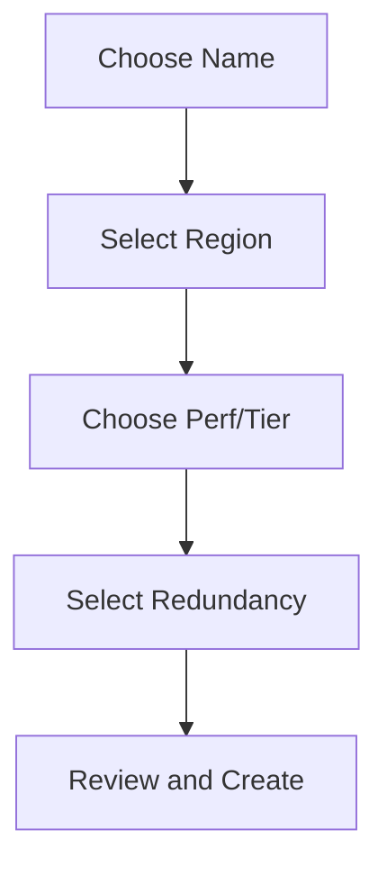

---
hide:
  - toc
content_sources:
  diagrams:
    - id: operations-create-storage-account
      type: flowchart
      source: mslearn-adapted
      mslearn_url: https://learn.microsoft.com/en-us/azure/storage/common/storage-account-overview
---

# Create Storage Account

Define parameters for consistent storage account creation.

| Parameter | Options | Considerations |
|-----------|---------|----------------|
| Name | 3-24 characters | Lowercase letters and numbers only. |
| Region | Location | Proximity to users and services. |
| Performance | Standard, Premium | Standard for general; Premium for low latency. |
| Redundancy | LRS, ZRS, GRS/RA-GRS, GZRS/RA-GZRS (depending on account type) | Trade off cost, availability, and geo-replication. |
| Access Tier | Hot, Cool, Cold | Optimization for data access frequency. |

!!! note
    Naming restrictions require 3-24 characters, lowercase letters, and numbers. Names must be globally unique across Azure.

<!-- diagram-id: operations-create-storage-account -->

## Validation Checklist

- Confirm subscription and resource group placement.
- Confirm account kind and performance tier match workload.
- Confirm redundancy selection matches RPO and RTO targets.
- Confirm public network access posture before deployment.
- Confirm minimum TLS version and secure transfer are enabled.
- Confirm access tier defaults for expected object lifecycle.

## See Also

- [Storage Account Basics](../platform/storage-account-basics.md)
- [Storage Account Design Baseline](../best-practices/storage-account-design-baseline.md)
- [Configure Network Rules](configure-network-rules.md)

## Sources
- [Storage account overview](https://learn.microsoft.com/en-us/azure/storage/common/storage-account-overview)
- [Create storage account](https://learn.microsoft.com/en-us/azure/storage/common/storage-account-create)
