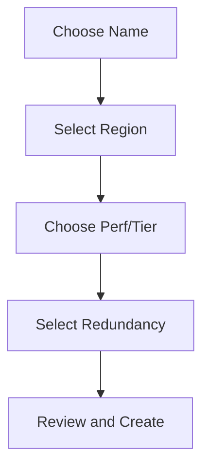

# Create Storage Account

Define parameters for consistent storage account creation.

| Parameter | Options | Considerations |
|-----------|---------|----------------|
| Name | 3-24 characters | Lowercase letters and numbers only. |
| Region | Location | Proximity to users and services. |
| Performance | Standard, Premium | Standard for general; Premium for low latency. |
| Redundancy | LRS, GRS, ZRS | Trade-off between cost and durability. |
| Access Tier | Hot, Cool, Cold | Optimization for data access frequency. |

!!! note
    Naming restrictions require 3-24 characters, lowercase letters, and numbers. Names must be globally unique across Azure.

## Sources
- [Storage account overview](https://learn.microsoft.com/en-us/azure/storage/common/storage-account-overview)
- [Create storage account](https://learn.microsoft.com/en-us/azure/storage/common/storage-account-create)
