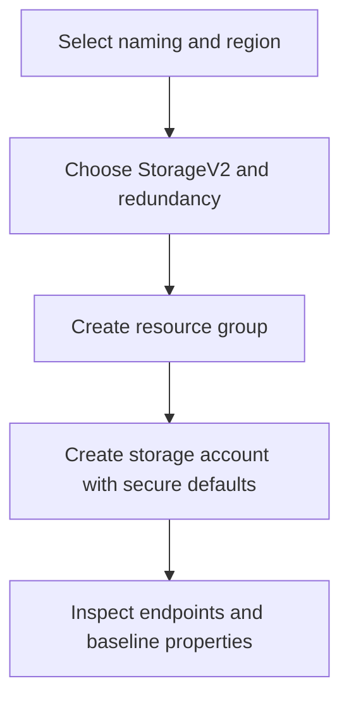

# Create Storage Account

Use this runbook when you need to create a new Azure Storage account that is ready for production operations instead of a minimal proof-of-concept deployment.

## Prerequisites

- Azure CLI 2.61.0 or later.
- Permission to create resource groups and storage accounts in the target subscription.
- A globally unique storage account name in `$STG`, resource group in `$RG`, and region in `$LOCATION`.
- A redundancy decision already mapped to business RPO and regional requirements.

## When to Use

- Provisioning a new workload landing zone for blobs, files, queues, or tables.
- Replacing a legacy account type with a new GPv2 account.
- Building a hardened target account before data migration or application onboarding.

## Procedure

Choose the account shape first, then create it with secure defaults instead of retrofitting those settings later.

<!-- diagram-id: operations-create-storage-account -->

```mermaid
flowchart TD
    A[Select naming and region] --> B[Choose StorageV2 and redundancy]
    B --> C[Create resource group]
    C --> D[Create storage account with secure defaults]
    D --> E[Inspect endpoints and baseline properties]
```

```bash
az group create \
  --name $RG \
  --location $LOCATION && \
az storage account create \
  --name $STG \
  --resource-group $RG \
  --location $LOCATION \
  --sku Standard_ZRS \
  --kind StorageV2 \
  --min-tls-version TLS1_2 \
  --allow-blob-public-access false \
  --allow-shared-key-access false \
  --https-only true \
  --public-network-access Disabled && \
az storage account show \
  --name $STG \
  --resource-group $RG \
  --query "{name:name,sku:sku.name,kind:kind,httpsOnly:enableHttpsTrafficOnly,minimumTlsVersion:minimumTlsVersion,publicNetworkAccess:publicNetworkAccess,primaryEndpoints:primaryEndpoints}" \
  --output json
```
| Command | Purpose |
| --- | --- |
| `az group create` | Create or confirm the resource group for the storage account. |
| `--name` | Set the resource group or storage account name for the command being run. |
| `--location` | Choose the Azure region for the resource group and storage account. |
| `az storage account create` | Create the new storage account. |
| `--resource-group` | Place the storage account in the intended resource group. |
| `--sku` | Select the redundancy and performance tier combination. |
| `--kind` | Create a GPv2 account instead of a legacy type. |
| `--min-tls-version` | Enforce the minimum allowed TLS version. |
| `--allow-blob-public-access` | Disable anonymous blob reads by default. |
| `--allow-shared-key-access` | Block account-key authorization if the workload supports Entra-based access. |
| `--https-only` | Require secure transport for requests. |
| `--public-network-access` | Disable the public endpoint until private access or firewall rules are ready. |
| `az storage account show` | Return the created account properties for evidence capture. |
| `--query` | Limit the output to the deployment decisions you need to validate. |
| `--output` | Emit JSON that can be attached to the change record. |

Expected result:

- `sku` matches the intended redundancy, such as `Standard_ZRS`.
- `kind` is `StorageV2`.
- `httpsOnly` is `true`, `minimumTlsVersion` is `TLS1_2`, and `publicNetworkAccess` is `Disabled`.

## Verification

Run the following query if you need a shorter operational summary after creation:

```bash
az storage account show \
  --name $STG \
  --resource-group $RG \
  --query "{status:provisioningState,blob:primaryEndpoints.blob,file:primaryEndpoints.file,queue:primaryEndpoints.queue,table:primaryEndpoints.table}" \
  --output table
```
| Command | Purpose |
| --- | --- |
| `az storage account show` | Confirm the account reached a succeeded provisioning state. |
| `--name` | Specify the new storage account. |
| `--resource-group` | Scope the lookup to the correct resource group. |
| `--query` | Return provisioning state and service endpoints only. |
| `--output` | Render a compact evidence table. |

Healthy evidence includes a `Succeeded` provisioning state and populated service endpoints for the services enabled by the account type.

## Rollback / Troubleshooting

- If account creation fails because the name is unavailable, generate a new lowercase alphanumeric name and retry.
- If `Standard_ZRS` is unavailable in the selected region, use `az account list-locations --output table` plus the regional availability guidance in the redundancy documentation before changing the SKU.
- If the account was created with the wrong exposure model, correct the settings immediately with `az storage account update` rather than deleting the account if downstream resources already depend on it.
- If the account is not needed and no dependent resources were added, remove it cleanly with `az storage account delete --name $STG --resource-group $RG --yes`.

## See Also

- [Configure Network Rules](configure-network-rules.md)
- [Configure Access and Identity](configure-access-and-identity.md)
- [Storage Account Basics](../platform/storage-account-basics.md)

## Sources

- [Create an Azure Storage account](https://learn.microsoft.com/en-us/azure/storage/common/storage-account-create)
- [Storage account overview](https://learn.microsoft.com/en-us/azure/storage/common/storage-account-overview)
