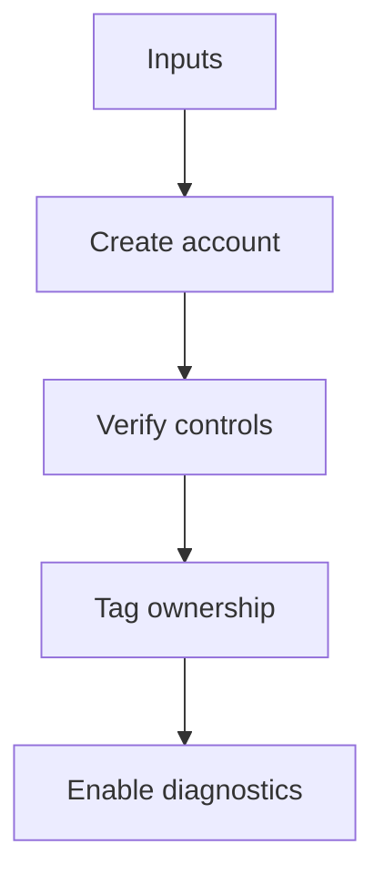

---
content_sources:
  diagrams:
    - id: operations-create-storage-account
      type: flowchart
      source: mslearn-adapted
      mslearn_url: https://learn.microsoft.com/en-us/azure/storage/common/storage-account-create
content_validation:
  status: verified
  last_reviewed: "2026-05-21"
  reviewer: ai-agent
  core_claims:
    - claim: "Create a storage account with secure defaults and enough metadata for later support"
      source: https://learn.microsoft.com/en-us/azure/storage/common/storage-account-create
      verified: true
    - claim: "Storage operations should include verification and rollback guidance before production use"
      source: https://learn.microsoft.com/en-us/azure/storage/common/storage-account-create
      verified: true
---

# Create Storage Account

Create a storage account with secure defaults and enough metadata for later support.

<!-- diagram-id: operations-create-storage-account -->

```mermaid
flowchart TD
    A[Inputs]
    B[Create account]
    A --> B
    C[Verify controls]
    B --> C
    D[Tag ownership]
    C --> D
    E[Enable diagnostics]
    D --> E
```

## Prerequisites

- Azure CLI authenticated to the correct tenant and subscription.
- Variables such as `$RG`, `$LOCATION`, `$STORAGE_NAME`, and workload-specific names are set.
- Operator has the control-plane and data-plane roles required for the task.
- A rollback owner is available for changes that affect production access.

## When to Use

- Provisioning a new Blob, Files, Queue, or Table workload.
- Replacing inconsistent manually created accounts with a standard baseline.

## Procedure

| Command | Purpose |
|---|---|
| `az group create` | Ensures the target resource group exists. |
| `az storage account create` | Creates a GPv2 storage account with secure baseline options. |
| `az storage account update` | Applies tags used for ownership and cost review. |

```bash
az group create \
    --name $RG \
    --location $LOCATION \
    --output json

az storage account create \
    --resource-group $RG \
    --name $STORAGE_NAME \
    --location $LOCATION \
    --sku Standard_ZRS \
    --kind StorageV2 \
    --access-tier Hot \
    --allow-blob-public-access false \
    --min-tls-version TLS1_2 \
    --https-only true \
    --default-action Deny \
    --output json

az storage account update \
    --resource-group $RG \
    --name $STORAGE_NAME \
    --tags workload=$WORKLOAD owner=$OWNER dataClass=$DATA_CLASS \
    --output json
```

## Verification

| Command | Purpose |
|---|---|
| `verification command` | Confirms that the intended configuration is active after the procedure. |

```bash
az storage account show \
    --resource-group $RG \
    --name $STORAGE_NAME \
    --query "{name:name,sku:sku.name,kind:kind,httpsOnly:enableHttpsTrafficOnly,publicBlob:allowBlobPublicAccess,defaultAction:networkRuleSet.defaultAction,tags:tags}" \
    --output json
```

## Rollback / Troubleshooting

- If access fails, check identity assignment, network rules, and DNS before changing data-plane permissions.
- If a change blocks production traffic, restore the previous firewall or public-network setting only for the approved recovery window.
- Capture command output and Azure Activity Log entries for incident notes.

## See Also

- [Storage Account Basics](../platform/storage-account-basics.md)
- [Storage Account Design Baseline](../best-practices/storage-account-design-baseline.md)
- [Storage Service Selection Guide](../reference/storage-service-selection-guide.md)

## Sources

- [Microsoft Learn: Create Storage Account](https://learn.microsoft.com/en-us/azure/storage/common/storage-account-create)
