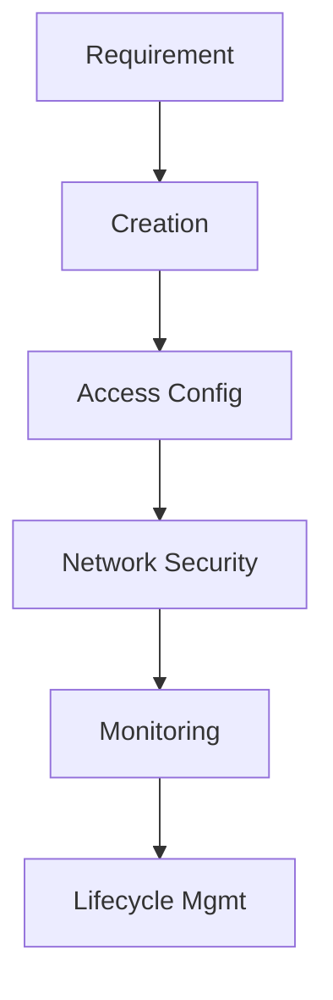

---
hide:
  - toc
---

# Operations

The operations section covers fundamental management tasks for Azure Storage. Use these guides to ensure consistency and reliability in your storage environment.

!!! tip
    Start with account provisioning, then lock down identity and networking, and finally enable monitoring and lifecycle controls.

| Operation | Description |
|-----------|-------------|
| [Create Storage Account](create-storage-account.md) | Standardized storage account provisioning. |
| [Manage Containers and Shares](manage-containers-and-shares.md) | Organizing blobs and file shares. |
| [Configure Access and Identity](configure-access-and-identity.md) | RBAC and identity management. |
| [Configure Network Rules](configure-network-rules.md) | Securing network access points. |
| [Use Private Endpoints](use-private-endpoints.md) | Deploying private connectivity. |
| [Manage Lifecycle Policies](manage-lifecycle-policies.md) | Automating data tiering and deletion. |
| [Backup and Data Protection](backup-and-data-protection.md) | Ensuring data durability and recovery. |
| [Monitoring and Alerting](monitoring-and-alerting.md) | Tracking health and performance. |
| [AzCopy and Data Movement](azcopy-and-data-movement.md) | Efficient data transfer operations. |

## Operational Sequence

- Provision account settings and redundancy.
- Configure identity and authorization model.
- Apply network controls and private connectivity.
- Enable protection controls and backups.
- Monitor metrics, logs, and alerts.
- Automate retention and data movement workflows.

## See Also

- [Learning Path](../start-here/learning-path.md)
- [Create Storage Account](create-storage-account.md)
- [Troubleshooting](../troubleshooting/index.md)

## Sources
- [Azure Storage overview](https://learn.microsoft.com/en-us/azure/storage/common/storage-introduction)
- [Storage account management](https://learn.microsoft.com/en-us/azure/storage/common/storage-account-overview)
