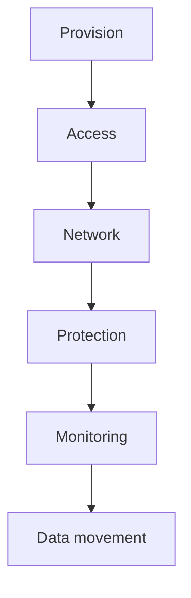

---
content_sources:
  diagrams:
    - id: operations-index
      type: flowchart
      source: mslearn-adapted
      mslearn_url: https://learn.microsoft.com/en-us/azure/storage/common/storage-account-overview
content_validation:
  status: verified
  last_reviewed: "2026-05-21"
  reviewer: ai-agent
  core_claims:
    - claim: "Azure Storage day-2 operations should include creation, access, networking, protection, monitoring, and data movement runbooks"
      source: https://learn.microsoft.com/en-us/azure/storage/common/storage-account-overview
      verified: true
---
# Operations

Use these runbooks to operate Azure Storage accounts with repeatable verification and rollback steps.

<!-- diagram-id: operations-index -->

```mermaid
flowchart TD
    A[Provision]
    B[Access]
    A --> B
    C[Network]
    B --> C
    D[Protection]
    C --> D
    E[Monitoring]
    D --> E
    F[Data movement]
    E --> F
```

## Operational Sequence

1. Create the storage account with secure defaults.
2. Configure identity and network boundaries.
3. Enable protection, monitoring, and lifecycle controls.
4. Validate data movement and troubleshooting evidence.

## Runbook Map

| Runbook | Purpose |
|---|---|
| [Create Storage Account](create-storage-account.md) | Standard account provisioning and ownership metadata. |
| [Manage Containers and Shares](manage-containers-and-shares.md) | Blob containers and Azure Files shares. |
| [Configure Access and Identity](configure-access-and-identity.md) | RBAC, Shared Key policy, and identity checks. |
| [Configure Network Rules](configure-network-rules.md) | Firewall and subnet access. |
| [Use Private Endpoints](use-private-endpoints.md) | Private Link and DNS validation. |
| [Manage Lifecycle Policies](manage-lifecycle-policies.md) | Tiering and retention automation. |
| [Backup and Data Protection](backup-and-data-protection.md) | Soft delete, versioning, and restore readiness. |
| [Monitoring and Alerting](monitoring-and-alerting.md) | Metrics, logs, and alerts. |
| [AzCopy and Data Movement](azcopy-and-data-movement.md) | Bulk transfer and validation. |

## See Also

- [Best Practices](../best-practices/index.md)
- [Troubleshooting](../troubleshooting/index.md)
- [Storage Service Selection Guide](../reference/storage-service-selection-guide.md)

## Sources

- [Microsoft Learn: Storage account overview](https://learn.microsoft.com/en-us/azure/storage/common/storage-account-overview)
