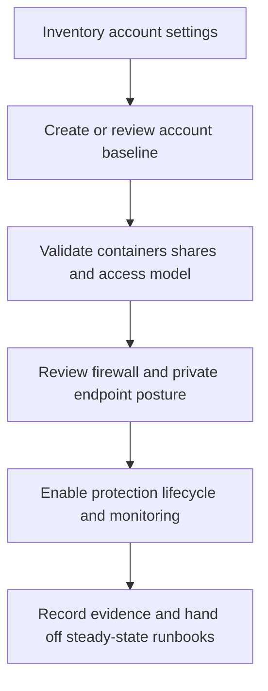

# Operations Overview

Use this page as the day-2 entry point for Azure Storage runbooks. Follow it when you need to baseline a new production account or confirm that an existing account still meets operational requirements.

## Prerequisites

- Azure CLI 2.61.0 or later installed and authenticated with `az login`.
- Rights to read and update the target storage account, Azure Monitor resources, and virtual network resources.
- A target storage account name in `$STG` and resource group name in `$RG`.
- A change window if you plan to modify public network access, lifecycle deletion rules, or protection settings.

## When to Use

- During a new production storage-account handoff.
- After inheriting an existing account with unknown security or observability posture.
- Before enabling application traffic that depends on blobs, file shares, lifecycle deletion, or private connectivity.
- As a quarterly control review to catch drift in identity, firewall, monitoring, and recovery settings.

## Procedure

Start with an account-level baseline, then branch to the detailed runbook that matches the control you need to implement or correct.

<!-- diagram-id: operations-index -->

```mermaid
flowchart TD
    A[Inventory account settings] --> B[Create or review account baseline]
    B --> C[Validate containers shares and access model]
    C --> D[Review firewall and private endpoint posture]
    D --> E[Enable protection lifecycle and monitoring]
    E --> F[Record evidence and hand off steady-state runbooks]
```

```bash
az storage account show \
  --name $STG \
  --resource-group $RG \
  --query "{sku:sku.name,kind:kind,httpsOnly:enableHttpsTrafficOnly,publicNetworkAccess:publicNetworkAccess,allowBlobPublicAccess:allowBlobPublicAccess,allowSharedKeyAccess:allowSharedKeyAccess,minimumTlsVersion:minimumTlsVersion,defaultAction:networkRuleSet.defaultAction,primaryLocation:primaryLocation}" \
  --output table
```
| Command | Purpose |
| --- | --- |
| `az storage account show` | Retrieve the current account configuration before making changes. |
| `--name` | Specify the storage account to review. |
| `--resource-group` | Scope the lookup to the correct resource group. |
| `--query` | Return only the settings needed for the baseline review. |
| `--output` | Render the result in a readable table. |

Expected result:

- `kind` is `StorageV2` unless the workload requires a premium specialist account.
- `httpsOnly` is `true` and `minimumTlsVersion` is `TLS1_2`.
- `publicNetworkAccess`, `defaultAction`, and `allowSharedKeyAccess` match the intended exposure model.

Then work through these runbooks in order:

1. [Create Storage Account](create-storage-account.md) for provisioning standards and secure defaults.
2. [Manage Containers and Shares](manage-containers-and-shares.md) for data layout, quotas, and soft-delete alignment.
3. [Configure Access and Identity](configure-access-and-identity.md) for RBAC, SAS, and shared-key reduction.
4. [Configure Network Rules](configure-network-rules.md) and [Use Private Endpoints](use-private-endpoints.md) for network isolation.
5. [Backup and Data Protection](backup-and-data-protection.md), [Manage Lifecycle Policies](manage-lifecycle-policies.md), and [Monitoring and Alerting](monitoring-and-alerting.md) for steady-state resilience.
6. [AzCopy and Data Movement](azcopy-and-data-movement.md) before any large ingestion, migration, or recovery copy.

## Verification

- Save the `az storage account show` output in the change record.
- Confirm that each child runbook produced its expected evidence before you mark the storage account ready.
- Re-run the baseline query after all changes and verify the settings now match the intended operating model.

## Rollback / Troubleshooting

- If the baseline query shows the wrong account or resource group, stop and correct `$RG` or `$STG` before continuing.
- If account settings drift after remediation, review Azure Policy assignments and automation jobs that might be reapplying older values.
- If a dependent application fails after a control change, use the specific child runbook for rollback rather than reverting unrelated controls.

## See Also

- [Create Storage Account](create-storage-account.md)
- [Configure Access and Identity](configure-access-and-identity.md)
- [Monitoring and Alerting](monitoring-and-alerting.md)

## Sources

- [Storage account overview](https://learn.microsoft.com/en-us/azure/storage/common/storage-account-overview)
- [Monitor Azure Blob Storage](https://learn.microsoft.com/en-us/azure/storage/blobs/monitor-blob-storage)
- [Azure Storage firewall rules and network access](https://learn.microsoft.com/en-us/azure/storage/common/storage-network-security)
