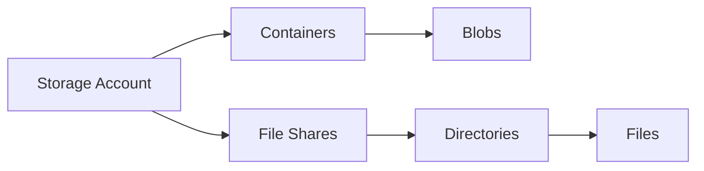

---
hide:
  - toc
content_sources:
  diagrams:
    - id: operations-manage-containers-and-shares
      type: flowchart
      source: mslearn-adapted
      mslearn_url: https://learn.microsoft.com/en-us/azure/storage/blobs/storage-blobs-introduction
---

# Manage Containers and Shares

Organize unstructured and shared data effectively.

!!! note
    Use containers for object workloads and file shares for lift-and-shift SMB or NFS-compatible workloads.

| Property | Blob Container | File Share |
|----------|----------------|------------|
| Protocol | HTTP/HTTPS/REST | SMB/NFS |
| Performance | Massive Scale | Low Latency |
| Access | Object-level | File-level |
| Soft Delete | Yes | Yes |
| Versioning | Yes | No |

<!-- diagram-id: operations-manage-containers-and-shares -->

## Management Checklist

- Define naming conventions for containers and shares.
- Set least-privilege permissions at the correct scope.
- Enable soft delete and retention where required.
- Validate quota and performance expectations for shares.
- Apply metadata and tags for governance and cost tracking.
- Review access patterns for hot and cold datasets.

## See Also

- [Blob Storage Basics](../platform/blob-storage-basics.md)
- [File Storage Basics](../platform/file-storage-basics.md)
- [Configure Access and Identity](configure-access-and-identity.md)

## Sources
- [Blob storage management](https://learn.microsoft.com/en-us/azure/storage/blobs/storage-blobs-introduction)
- [Azure Files overview](https://learn.microsoft.com/en-us/azure/storage/files/storage-files-introduction)
