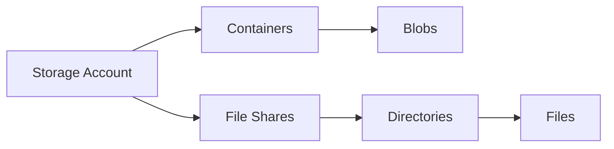

# Manage Containers and Shares

Organize unstructured and shared data effectively.

| Property | Blob Container | File Share |
|----------|----------------|------------|
| Protocol | HTTP/HTTPS/REST | SMB/NFS |
| Performance | Massive Scale | Low Latency |
| Access | Object-level | File-level |
| Soft Delete | Yes | Yes |
| Versioning | Yes | No |

## Sources
- [Blob storage management](https://learn.microsoft.com/en-us/azure/storage/blobs/storage-blobs-introduction)
- [Azure Files overview](https://learn.microsoft.com/en-us/azure/storage/files/storage-files-introduction)
