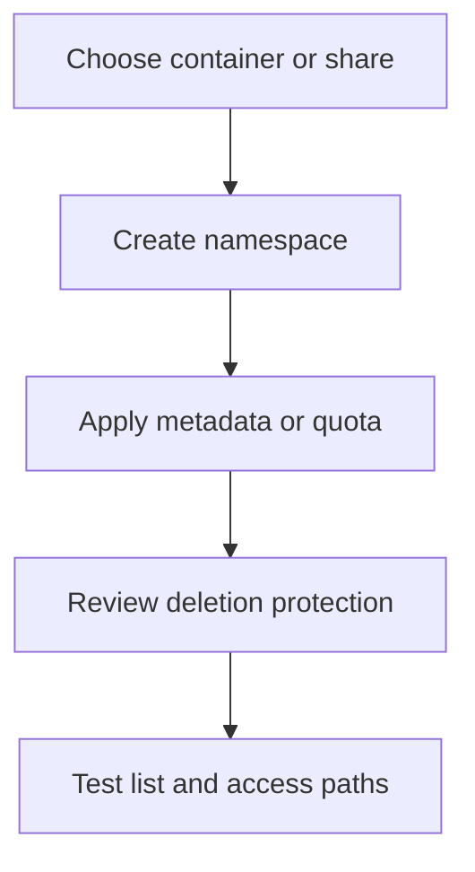

# Manage Containers and Shares

Use this runbook to create or standardize the data structures that applications actually use: blob containers for object data and Azure file shares for shared file-system workloads.

## Prerequisites

- An existing storage account in `$STG` and resource group in `$RG`.
- Azure CLI authenticated with a principal that can manage both blob and file services.
- For data-plane commands, either Microsoft Entra authorization or a controlled break-glass key path already approved.
- Naming conventions for containers, file shares, metadata, and retention labels.

## When to Use

- Creating a new application container or file share.
- Standardizing soft-delete and quota settings after a migration.
- Splitting object and file workloads that were previously stored ad hoc in one account.

## Procedure

Create the storage namespaces deliberately, then verify that access scope, share quota, and deletion protection align with the workload.

<!-- diagram-id: operations-manage-containers-and-shares -->

```mermaid
flowchart TD
    A[Choose container or share] --> B[Create namespace]
    B --> C[Apply metadata or quota]
    C --> D[Review deletion protection]
    D --> E[Test list and access paths]
```

```bash
az storage container create \
  --name app-data \
  --account-name $STG \
  --auth-mode login \
  --public-access off && \
az storage share-rm create \
  --storage-account $STG \
  --resource-group $RG \
  --name profiles \
  --quota 1024 \
  --enabled-protocols SMB && \
az storage share-rm show \
  --storage-account $STG \
  --resource-group $RG \
  --name profiles \
  --output json
```
| Command | Purpose |
| --- | --- |
| `az storage container create` | Create the blob container that will hold object data. |
| `--name` | Specify the container or file share name. |
| `--account-name` | Target the correct storage account for data-plane container creation. |
| `--auth-mode` | Use Microsoft Entra authorization for the container operation. |
| `--public-access` | Prevent anonymous blob access on the new container. |
| `az storage share-rm create` | Create the Azure file share through the management plane. |
| `--storage-account` | Identify the storage account that owns the file share. |
| `--resource-group` | Identify the resource group that owns the storage account. |
| `--quota` | Set the file share size limit in GiB. |
| `--enabled-protocols` | Choose SMB or NFS based on the workload. |
| `az storage share-rm show` | Return the resulting file share configuration for review. |
| `--output` | Emit JSON evidence for the created share. |

Expected result:

- The container is created with `public-access` disabled.
- The file share exists with the expected quota and protocol.
- The JSON evidence shows the share state as `Succeeded`.

## Verification

```bash
az storage container list \
  --account-name $STG \
  --auth-mode login \
  --query "[].{name:name,publicAccess:properties.publicAccess,lastModified:properties.lastModified}" \
  --output table && \
az storage share-rm list \
  --storage-account $STG \
  --resource-group $RG \
  --query "[].{name:name,quota:shareQuota,protocol:enabledProtocols,deleted:deleted}" \
  --output table
```
| Command | Purpose |
| --- | --- |
| `az storage container list` | Confirm the container inventory and public-access state. |
| `--account-name` | Query containers in the intended storage account. |
| `--auth-mode` | Use Entra-based listing for blob containers. |
| `--query` | Return only the evidence fields needed for review. |
| `--output` | Render a table for quick inspection. |
| `az storage share-rm list` | Confirm file share inventory and quotas. |
| `--storage-account` | Scope the file-share list to the intended account. |
| `--resource-group` | Scope the file-share list to the correct resource group. |

Healthy evidence shows the new container, the new file share, and the expected quota and protocol values.

## Rollback / Troubleshooting

- If an application was pointed to the wrong container, create the correct container first and then update the application configuration before deleting the mistaken one.
- If the file share quota is too small, expand it with `az storage share-rm update` before the workload starts filling the share.
- If a container or share should not remain, delete it only after confirming no active clients depend on it.
- If deletes must be reversible, enable the appropriate data-protection features from [Backup and Data Protection](backup-and-data-protection.md) before cleanup.

## See Also

- [Backup and Data Protection](backup-and-data-protection.md)
- [Configure Access and Identity](configure-access-and-identity.md)
- [Blob Storage Basics](../platform/blob-storage-basics.md)

## Sources

- [Introduction to Blob (object) Storage](https://learn.microsoft.com/en-us/azure/storage/blobs/storage-blobs-introduction)
- [Introduction to Azure Files](https://learn.microsoft.com/en-us/azure/storage/files/storage-files-introduction)
